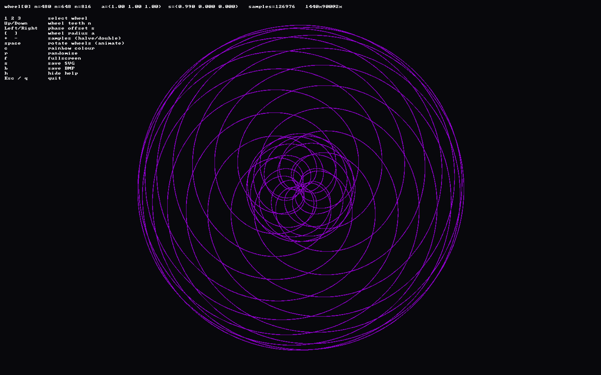

# flowery





Real-time, interactive spirograph renderer — **SDL3 port** of the classic
gnuplot "wheels on wheels on wheels" (Farris curve) generator.

The original shell/gnuplot version is preserved under [`legacy/`](legacy/).
This C/SDL3 rewrite computes the same curve on the CPU and draws it to a
window every frame:

```math
z(t) = a₁·e^{i·2π(n₁·t + s₁)} + a₂·e^{i·2π(n₂·t + s₂)} + a₃·e^{i·2π(n₃·t + s₃)}
```

- `n` — wheel teeth (integer, how many petals)
- `a` — wheel radius
- `s` — phase offset, in turns (0..1)
- `samples` — number of t steps used to trace the curve

## Requirements

- A C++20 compiler
- [SDL3](https://github.com/libsdl-org/SDL) development package
  (`libsdl3-dev` on Debian/Ubuntu, `sdl3` on some distros)

## Build

```sh
./build.sh
```

or, equivalently, `make`. `./build.sh clean` removes the binary.

The build uses `-march=native`, which is what enables the AVX2 + FMA paths in
the curve kernel, the bounding box and the screen mapping. The sources build
without it and fall back to scalar code that produces the same numbers, just
slower — for a portable binary, override the flags:

```sh
make CXXFLAGS='-O2 -std=c++20 -Wall -Wextra'
```

## Run

```sh
./run.sh                 # default wheel (480 648 816)
./run.sh 5 7 12          # custom wheels
./run.sh 4 7 9  5000     # custom wheels + sample count
```

`run.sh` builds first if needed, then starts `./flowery`, which can also be
run directly. Without a display, `SDL_VIDEODRIVER=offscreen ./run.sh` starts
headless (useful only as a smoke test).

## Test

```sh
./test.sh                # unit tests + every legacy gnuplot sample
./test.sh legacy/samples # compare specific files or directories instead
FLOWERY_SVG_TESTS=0 ./test.sh   # unit tests only
```

The unit tests check the curve analytically (a single wheel is a circle, the
loop closes, equal wheels superpose, three wheels phased 1/3 apart cancel,
radii scale it linearly, the bounding box is right). The second half is a
fidelity check against the original renderer: every SVG in `legacy/samples`
is read back, its wheel counts taken from the file name, the curve recomputed
and the two point sets compared after a least-squares similarity fit. The 594
comparable files agree with gnuplot to 0.043px on average; 20 legacy files
hold fewer points than the sample count in their own name, so they are
reported rather than compared.

## Controls

| Key | Action |
|-----|--------|
| `1` `2` `3` | select wheel to edit |
| `↑` `↓` | change wheel teeth n (±1, Shift ±10) |
| `←` `→` | change phase offset s (Shift: bigger step) |
| `[` `]` | change wheel radius a (Shift: bigger step) |
| `+` `-` | double / halve the sample count |
| `Space` | toggle phase animation (wheels keep turning) |
| `c` | toggle rainbow gradient colour |
| `r` | randomise the wheels |
| `f` | toggle fullscreen |
| `s` | save current curve as SVG |
| `b` | save a BMP screenshot |
| `h` | toggle help overlay |
| `Esc` / `q` | quit |

Holding `↑` `↓` `←` `→` or `[` `]` repeats the key — after a 300 ms delay it
fires every 40 ms — so n, s and a can be swept without hammering the
keyboard. The keys that toggle or save something deliberately do not repeat.

## Display scaling (HiDPI)

The window is created with `SDL_WINDOW_HIGH_PIXEL_DENSITY`, so on a scaled
display the back buffer is the full native resolution: a 900×900 point window
gets an 1800×1800 pixel buffer on a 2× screen, and one drawn pixel is one
physical pixel. All drawing is done in points with `SDL_SetRenderScale()`
applied, so the curve keeps its size and margins on any display and only the
raster resolution changes. The status line shows what you are getting, e.g.
`900x900@2x`. Fullscreen (`f`) uses the same path, so a fullscreen window is
rendered at the display's native resolution rather than stretched.

## Saving

- `s` writes `spiro-<n1>-<n2>-<n3>-<samples>.svg` — a vector polyline in
  window points, so it has no resolution of its own (close to what
  `legacy/cx.sh` produced). It always holds every sample; the curve drawn in
  the window is thinned to what the screen can show when the sample count runs
  into six figures, and the status line reports both numbers.
- `b` writes the raw window pixels as BMP (`spiro-...bmp`) — at the native
  resolution of the display, i.e. 2× on a 2× screen.

## Source layout

```
build.sh         build       test.sh   unit tests + gnuplot fidelity check
run.sh           build and run
src/flowery.h    curve math
src/flowery.cpp  curve math, AVX2 kernel and bounding box
src/main.cpp     SDL3 app, input handling, rendering
tests/           the test suite
legacy/          the original shell + gnuplot version
```

[NOTES.md](NOTES.md) records what the legacy pipeline does, the conventions
the port has to match, how the two were shown to agree, and what the
optimisations were worth.

## License

GPL-3.0, see [legacy/README.md](legacy/README.md) and
[legacy/cx.sh](legacy/cx.sh) for the original notice.
Copyright (C) 2019 Krzysztof Kowalski / Víctor Luaña.
