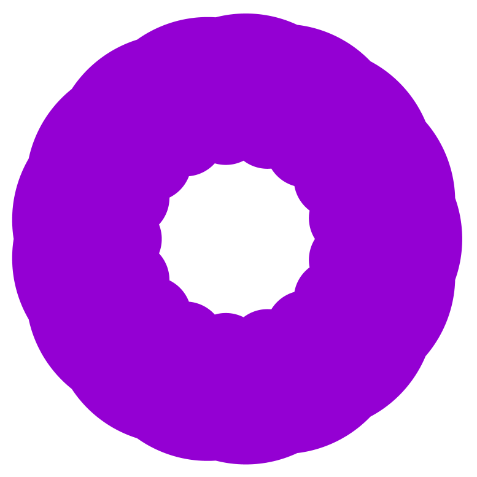
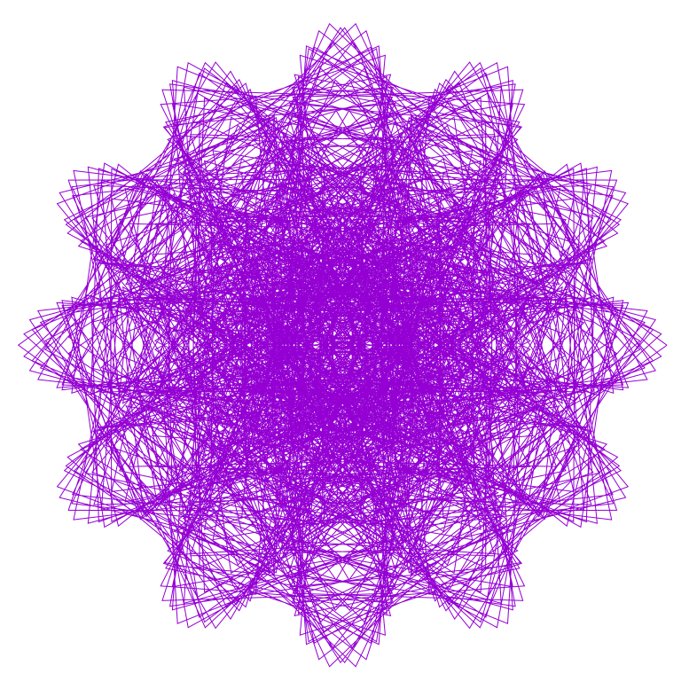
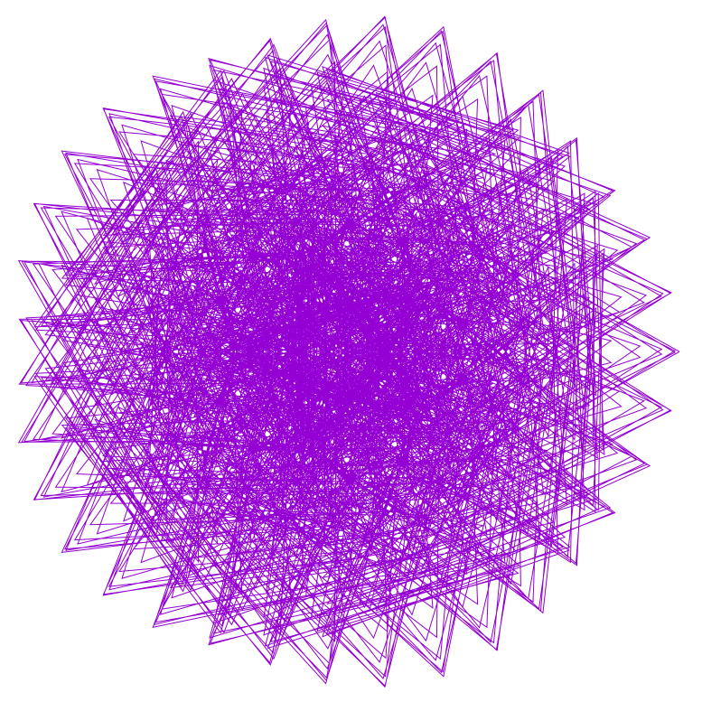

# Geometry calculator

Produces beautiful geometry

Less than 10kB size! [*1]

## Requiremens:
```
brew install parallel gnuplot
```
or

```
sh ./requirements.sh
```

## Usage

```
./run.sh
```

or 

```
run.sh NUMBERYOUWANT
```

## For some nice samples press:

```
./samples.sh
open samples
```

## To generate just 1 image

x=480, y=648, z=816, plotsize=2001

```
mkdir tmp
./cx.sh 480 648 816 tmp/ 2001
open tmp
```

### Links

https://linuxgazette.net/133/luana.html

## Samples


Values X: 0001 Y: 0001 Z: 0284, P: 2001 


Values X: 0001 Y: 0001 Z: 0331, P: 2001 


Values X: 0001 Y: 0001 Z: 0332, P: 2001 


Values X: 0001 Y: 0001 Z: 0333, P: 2001 


Values X: 0001 Y: 0001 Z: 0363, P: 2001 


Values X: 0001 Y: 0001 Z: 0398, P: 2001 


Values X: 0001 Y: 0001 Z: 0399, P: 2001 


Values X: 0001 Y: 0001 Z: 0400, P: 2001 


Values X: 0001 Y: 0001 Z: 0443, P: 2001 


Values X: 0001 Y: 0001 Z: 0444, P: 2001 


Values X: 0001 Y: 0001 Z: 0445, P: 2001 


Values X: 0001 Y: 0001 Z: 0446, P: 2001 


Values X: 0001 Y: 0001 Z: 0447, P: 2001 


Values X: 0001 Y: 0001 Z: 0463, P: 2001 


Values X: 0001 Y: 0001 Z: 0464, P: 2001 


Values X: 0001 Y: 0001 Z: 0481, P: 99999 


Values X: 0001 Y: 0001 Z: 0495, P: 2001 


Values X: 0001 Y: 0001 Z: 0496, P: 2001 


Values X: 0001 Y: 0001 Z: 0498, P: 2001 


Values X: 0001 Y: 0001 Z: 0499, P: 2001 


Values X: 0001 Y: 0001 Z: 0500, P: 2001 


Values X: 0001 Y: 0001 Z: 0501, P: 2001 


Values X: 0001 Y: 0001 Z: 0502, P: 2001 


Values X: 0001 Y: 0001 Z: 0503, P: 2001 


Values X: 0001 Y: 0001 Z: 0545, P: 2001 


Values X: 0001 Y: 0001 Z: 0547, P: 2001 


Values X: 0001 Y: 0001 Z: 0548, P: 2001 


Values X: 0001 Y: 0001 Z: 0570, P: 2001 


Values X: 0001 Y: 0001 Z: 0571, P: 2001 


Values X: 0001 Y: 0001 Z: 0572, P: 2001 


Values X: 0001 Y: 0001 Z: 0573, P: 2001 


Values X: 0001 Y: 0001 Z: 0574, P: 2001 


Values X: 0001 Y: 0001 Z: 0602, P: 2001 


Values X: 0001 Y: 0001 Z: 0661, P: 2001 


Values X: 0001 Y: 0001 Z: 0662, P: 2001 


Values X: 0001 Y: 0001 Z: 0663, P: 2001 


Values X: 0001 Y: 0001 Z: 0664, P: 2001 


Values X: 0001 Y: 0001 Z: 0665, P: 2001 


Values X: 0001 Y: 0001 Z: 0666, P: 2001 


Values X: 0001 Y: 0001 Z: 0667, P: 2001 


Values X: 0001 Y: 0001 Z: 0668, P: 2001 


Values X: 0001 Y: 0001 Z: 0669, P: 2001 


Values X: 0001 Y: 0001 Z: 0670, P: 2001 


Values X: 0001 Y: 0001 Z: 0671, P: 2001 


Values X: 0001 Y: 0001 Z: 0672, P: 2001 


Values X: 0001 Y: 0001 Z: 0716, P: 2001 


Values X: 0001 Y: 0001 Z: 0727, P: 2001 


Values X: 0001 Y: 0001 Z: 0728, P: 2001 


Values X: 0001 Y: 0001 Z: 0729, P: 2001 


Values X: 0001 Y: 0001 Z: 0730, P: 2001 


Values X: 0001 Y: 0001 Z: 0752, P: 2001 


Values X: 0001 Y: 0001 Z: 0798, P: 2001 


Values X: 0001 Y: 0001 Z: 0799, P: 2001 


Values X: 0001 Y: 0001 Z: 0800, P: 2001 


Values X: 0001 Y: 0001 Z: 0801, P: 2001 


Values X: 0001 Y: 0001 Z: 0802, P: 2001 


Values X: 0001 Y: 0001 Z: 0835, P: 2001 


Values X: 0001 Y: 0001 Z: 0855, P: 2001 


Values X: 0001 Y: 0001 Z: 0856, P: 2001 


Values X: 0001 Y: 0001 Z: 0857, P: 2001 


Values X: 0001 Y: 0001 Z: 0859, P: 2001 


Values X: 0001 Y: 0001 Z: 0860, P: 2001 


Values X: 0001 Y: 0001 Z: 0886, P: 2001 


Values X: 0001 Y: 0001 Z: 0887, P: 2001 


Values X: 0001 Y: 0001 Z: 0889, P: 2001 


Values X: 0001 Y: 0001 Z: 0891, P: 2001 


Values X: 0001 Y: 0001 Z: 0911, P: 2001 


Values X: 0001 Y: 0001 Z: 0912, P: 2001 


Values X: 0001 Y: 0001 Z: 0925, P: 2001 


Values X: 0001 Y: 0001 Z: 0935, P: 2001 


Values X: 0001 Y: 0001 Z: 0939, P: 2001 


Values X: 0001 Y: 0001 Z: 0943, P: 2001 


Values X: 0001 Y: 0001 Z: 0994, P: 2001 


Values X: 0001 Y: 0001 Z: 0995, P: 2001 


Values X: 0001 Y: 0001 Z: 0996, P: 2001 


Values X: 0001 Y: 0001 Z: 0998, P: 2001 


Values X: 0001 Y: 0001 Z: 0999, P: 2001 


Values X: 0001 Y: 0001 Z: 1000, P: 2001 


Values X: 2 Y: ! Z: 2, P: 2.svg 
[ Y:  Z: , P: ](./samples/)

Values X: 0001 Y: 0001 Z: 1000, P: 2001 


Values X: 0001 Y: 0001 Z: 1001, P: 2001 


Values X: 2 Y: ! Z: 2, P: 2.svg 
[ Y:  Z: , P: ](./samples/)

Values X: 0001 Y: 0001 Z: 1001, P: 2001 


Values X: 0001 Y: 0001 Z: 1002, P: 2001 


Values X: 2 Y: ! Z: 2, P: 2.svg 
[ Y:  Z: , P: ](./samples/)

Values X: 0001 Y: 0001 Z: 1002, P: 2001 


Values X: 0001 Y: 0001 Z: 1003, P: 2001 


Values X: 2 Y: ! Z: 2, P: 2.svg 
[ Y:  Z: , P: ](./samples/)

Values X: 0001 Y: 0001 Z: 1003, P: 2001 


Values X: 0001 Y: 0001 Z: 1004, P: 2001 


Values X: 2 Y: ! Z: 2, P: 2.svg 
[ Y:  Z: , P: ](./samples/)

Values X: 0001 Y: 0001 Z: 1004, P: 2001 


Values X: 0001 Y: 0001 Z: 1005, P: 2001 


Values X: 2 Y: ! Z: 2, P: 2.svg 
[ Y:  Z: , P: ](./samples/)

Values X: 0001 Y: 0001 Z: 1005, P: 2001 


Values X: 0001 Y: 0001 Z: 1006, P: 2001 


Values X: 2 Y: ! Z: 2, P: 2.svg 
[ Y:  Z: , P: ](./samples/)

Values X: 0001 Y: 0001 Z: 1006, P: 2001 


Values X: 0001 Y: 0001 Z: 1007, P: 2001 


Values X: 2 Y: ! Z: 2, P: 2.svg 
[ Y:  Z: , P: ](./samples/)

Values X: 0001 Y: 0001 Z: 1007, P: 2001 


Values X: 0001 Y: 0001 Z: 1008, P: 2001 


Values X: 2 Y: ! Z: 2, P: 2.svg 
[ Y:  Z: , P: ](./samples/)

Values X: 0001 Y: 0001 Z: 1008, P: 2001 


Values X: 0001 Y: 0001 Z: 1197, P: 2001 


Values X: 2 Y: ! Z: 2, P: 2.svg 
[ Y:  Z: , P: ](./samples/)

Values X: 0001 Y: 0001 Z: 1197, P: 2001 


Values X: 0001 Y: 0001 Z: 1198, P: 2001 


Values X: 2 Y: ! Z: 2, P: 2.svg 
[ Y:  Z: , P: ](./samples/)

Values X: 0001 Y: 0001 Z: 1198, P: 2001 


Values X: 0001 Y: 0001 Z: 1199, P: 2001 


Values X: 2 Y: ! Z: 2, P: 2.svg 
[ Y:  Z: , P: ](./samples/)

Values X: 0001 Y: 0001 Z: 1199, P: 2001 


Values X: 0001 Y: 0001 Z: 1200, P: 2001 


Values X: 2 Y: ! Z: 2, P: 2.svg 
[ Y:  Z: , P: ](./samples/)

Values X: 0001 Y: 0001 Z: 1200, P: 2001 


Values X: 0001 Y: 0001 Z: 1201, P: 2001 


Values X: 2 Y: ! Z: 2, P: 2.svg 
[ Y:  Z: , P: ](./samples/)

Values X: 0001 Y: 0001 Z: 1201, P: 2001 


Values X: 0001 Y: 0001 Z: 1202, P: 2001 


Values X: 2 Y: ! Z: 2, P: 2.svg 
[ Y:  Z: , P: ](./samples/)

Values X: 0001 Y: 0001 Z: 1202, P: 2001 


Values X: 0001 Y: 0001 Z: 1203, P: 2001 


Values X: 2 Y: ! Z: 2, P: 2.svg 
[ Y:  Z: , P: ](./samples/)

Values X: 0001 Y: 0001 Z: 1203, P: 2001 


Values X: 0001 Y: 0001 Z: 12500, P: 99999 


Values X: 0001 Y: 0001 Z: 12501, P: 99999 


Values X: 0001 Y: 0001 Z: 1252, P: 2001 


Values X: 2 Y: ! Z: 2, P: 2.svg 
[ Y:  Z: , P: ](./samples/)

Values X: 0001 Y: 0001 Z: 1252, P: 2001 


Values X: 0001 Y: 0001 Z: 1329, P: 2001 


Values X: 2 Y: ! Z: 2, P: 2.svg 
[ Y:  Z: , P: ](./samples/)

Values X: 0001 Y: 0001 Z: 1329, P: 2001 


Values X: 0001 Y: 0001 Z: 1330, P: 2001 


Values X: 2 Y: ! Z: 2, P: 2.svg 
[ Y:  Z: , P: ](./samples/)

Values X: 0001 Y: 0001 Z: 1330, P: 2001 


Values X: 0001 Y: 0001 Z: 1331, P: 2001 


Values X: 2 Y: ! Z: 2, P: 2.svg 
[ Y:  Z: , P: ](./samples/)

Values X: 0001 Y: 0001 Z: 1331, P: 2001 


Values X: 0001 Y: 0001 Z: 1332, P: 2001 


Values X: 2 Y: ! Z: 2, P: 2.svg 
[ Y:  Z: , P: ](./samples/)

Values X: 0001 Y: 0001 Z: 1332, P: 2001 


Values X: 0001 Y: 0001 Z: 1333, P: 2001 


Values X: 2 Y: ! Z: 2, P: 2.svg 
[ Y:  Z: , P: ](./samples/)

Values X: 0001 Y: 0001 Z: 1333, P: 2001 


Values X: 0001 Y: 0001 Z: 1334, P: 2001 


Values X: 2 Y: ! Z: 2, P: 2.svg 
[ Y:  Z: , P: ](./samples/)

Values X: 0001 Y: 0001 Z: 1334, P: 2001 


Values X: 0001 Y: 0001 Z: 1335, P: 2001 


Values X: 2 Y: ! Z: 2, P: 2.svg 
[ Y:  Z: , P: ](./samples/)

Values X: 0001 Y: 0001 Z: 1335, P: 2001 


Values X: 0001 Y: 0001 Z: 1336, P: 2001 


Values X: 2 Y: ! Z: 2, P: 2.svg 
[ Y:  Z: , P: ](./samples/)

Values X: 0001 Y: 0001 Z: 1336, P: 2001 


Values X: 0001 Y: 0001 Z: 14281, P: 99999 


Values X: 0001 Y: 0001 Z: 14282, P: 99999 


Values X: 0001 Y: 0001 Z: 14283, P: 99999 


Values X: 0001 Y: 0001 Z: 14284, P: 99999 


Values X: 0001 Y: 0001 Z: 14285, P: 99999 


Values X: 0001 Y: 0001 Z: 14286, P: 99999 


Values X: 0001 Y: 0001 Z: 14288, P: 99999 


Values X: 0001 Y: 0001 Z: 14289, P: 99999 


Values X: 0001 Y: 0001 Z: 1497, P: 2001 


Values X: 2 Y: ! Z: 2, P: 2.svg 
[ Y:  Z: , P: ](./samples/)

Values X: 0001 Y: 0001 Z: 1497, P: 2001 


Values X: 0001 Y: 0001 Z: 1498, P: 2001 


Values X: 2 Y: ! Z: 2, P: 2.svg 
[ Y:  Z: , P: ](./samples/)

Values X: 0001 Y: 0001 Z: 1498, P: 2001 


Values X: 0001 Y: 0001 Z: 1499, P: 2001 


Values X: 2 Y: ! Z: 2, P: 2.svg 
[ Y:  Z: , P: ](./samples/)

Values X: 0001 Y: 0001 Z: 1499, P: 2001 


Values X: 0001 Y: 0001 Z: 1500, P: 2001 


Values X: 2 Y: ! Z: 2, P: 2.svg 
[ Y:  Z: , P: ](./samples/)

Values X: 0001 Y: 0001 Z: 1500, P: 2001 


Values X: 0001 Y: 0001 Z: 1501, P: 2001 


Values X: 2 Y: ! Z: 2, P: 2.svg 
[ Y:  Z: , P: ](./samples/)

Values X: 0001 Y: 0001 Z: 1501, P: 2001 


Values X: 0001 Y: 0001 Z: 1502, P: 2001 


Values X: 2 Y: ! Z: 2, P: 2.svg 
[ Y:  Z: , P: ](./samples/)

Values X: 0001 Y: 0001 Z: 1502, P: 2001 


Values X: 0001 Y: 0001 Z: 1503, P: 2001 


Values X: 2 Y: ! Z: 2, P: 2.svg 
[ Y:  Z: , P: ](./samples/)

Values X: 0001 Y: 0001 Z: 1503, P: 2001 


Values X: 0001 Y: 0001 Z: 16662, P: 99999 


Values X: 0001 Y: 0001 Z: 16663, P: 99999 


Values X: 0001 Y: 0001 Z: 16664, P: 99999 


Values X: 0001 Y: 0001 Z: 16665, P: 99999 


Values X: 0001 Y: 0001 Z: 16666, P: 99999 


Values X: 0001 Y: 0001 Z: 16667, P: 99999 


Values X: 0001 Y: 0001 Z: 16668, P: 99999 


Values X: 0001 Y: 0001 Z: 16669, P: 99999 


Values X: 0001 Y: 0001 Z: 1991, P: 2001 


Values X: 2 Y: ! Z: 2, P: 2.svg 
[ Y:  Z: , P: ](./samples/)

Values X: 0001 Y: 0001 Z: 1991, P: 2001 


Values X: 0001 Y: 0001 Z: 1992, P: 2001 


Values X: 2 Y: ! Z: 2, P: 2.svg 
[ Y:  Z: , P: ](./samples/)

Values X: 0001 Y: 0001 Z: 1992, P: 2001 


Values X: 0001 Y: 0001 Z: 1993, P: 2001 


Values X: 2 Y: ! Z: 2, P: 2.svg 
[ Y:  Z: , P: ](./samples/)

Values X: 0001 Y: 0001 Z: 1993, P: 2001 


Values X: 0001 Y: 0001 Z: 1994, P: 2001 


Values X: 2 Y: ! Z: 2, P: 2.svg 
[ Y:  Z: , P: ](./samples/)

Values X: 0001 Y: 0001 Z: 1994, P: 2001 


Values X: 0001 Y: 0001 Z: 1995, P: 2001 


Values X: 2 Y: ! Z: 2, P: 2.svg 
[ Y:  Z: , P: ](./samples/)

Values X: 0001 Y: 0001 Z: 1995, P: 2001 


Values X: 0001 Y: 0001 Z: 1996, P: 2001 


Values X: 2 Y: ! Z: 2, P: 2.svg 
[ Y:  Z: , P: ](./samples/)

Values X: 0001 Y: 0001 Z: 1996, P: 2001 


Values X: 0001 Y: 0001 Z: 1997, P: 2001 


Values X: 2 Y: ! Z: 2, P: 2.svg 
[ Y:  Z: , P: ](./samples/)

Values X: 0001 Y: 0001 Z: 1997, P: 2001 


Values X: 0001 Y: 0001 Z: 1998, P: 2001 


Values X: 2 Y: ! Z: 2, P: 2.svg 
[ Y:  Z: , P: ](./samples/)

Values X: 0001 Y: 0001 Z: 1998, P: 2001 


Values X: 0001 Y: 0001 Z: 1999, P: 2001 


Values X: 2 Y: ! Z: 2, P: 2.svg 
[ Y:  Z: , P: ](./samples/)

Values X: 0001 Y: 0001 Z: 1999, P: 2001 


Values X: 0001 Y: 0001 Z: 1999, P: 9999 


Values X: 2 Y: ! Z: 2, P: 2.svg 
[ Y:  Z: , P: ](./samples/)

Values X: 0001 Y: 0001 Z: 1999, P: 9999 


Values X: 0001 Y: 0001 Z: 19994, P: 99999 


Values X: 0001 Y: 0001 Z: 19995, P: 99999 


Values X: 0001 Y: 0001 Z: 19996, P: 99999 


Values X: 0001 Y: 0001 Z: 19997, P: 99999 


Values X: 0001 Y: 0001 Z: 19998, P: 99999 


Values X: 0001 Y: 0001 Z: 19999, P: 99999 


Values X: 0001 Y: 0001 Z: 2000, P: 9999 


Values X: 2 Y: ! Z: 2, P: 2.svg 
[ Y:  Z: , P: ](./samples/)

Values X: 0001 Y: 0001 Z: 2000, P: 9999 


Values X: 0001 Y: 0001 Z: 20000, P: 99999 


Values X: 0001 Y: 0001 Z: 20001, P: 99999 


Values X: 0001 Y: 0001 Z: 20002, P: 99999 


Values X: 0001 Y: 0001 Z: 20003, P: 99999 


Values X: 0001 Y: 0001 Z: 2001, P: 9999 


Values X: 2 Y: ! Z: 2, P: 2.svg 
[ Y:  Z: , P: ](./samples/)

Values X: 0001 Y: 0001 Z: 2001, P: 9999 


Values X: 0001 Y: 0001 Z: 2103, P: 9999 


Values X: 2 Y: ! Z: 2, P: 2.svg 
[ Y:  Z: , P: ](./samples/)

Values X: 0001 Y: 0001 Z: 2103, P: 9999 


Values X: 0001 Y: 0001 Z: 22218, P: 99999 


Values X: 0001 Y: 0001 Z: 22219, P: 99999 


Values X: 0001 Y: 0001 Z: 22220, P: 99999 


Values X: 0001 Y: 0001 Z: 22221, P: 99999 


Values X: 0001 Y: 0001 Z: 22222, P: 99999 


Values X: 0001 Y: 0001 Z: 22223, P: 99999 


Values X: 0001 Y: 0001 Z: 22224, P: 99999 


Values X: 0001 Y: 0001 Z: 22225, P: 99999 


Values X: 0001 Y: 0001 Z: 2498, P: 9999 


Values X: 2 Y: ! Z: 2, P: 2.svg 
[ Y:  Z: , P: ](./samples/)

Values X: 0001 Y: 0001 Z: 2498, P: 9999 


Values X: 0001 Y: 0001 Z: 2499, P: 9999 


Values X: 2 Y: ! Z: 2, P: 2.svg 
[ Y:  Z: , P: ](./samples/)

Values X: 0001 Y: 0001 Z: 2499, P: 9999 


Values X: 0001 Y: 0001 Z: 24992, P: 99999 


Values X: 0001 Y: 0001 Z: 24993, P: 99999 


Values X: 0001 Y: 0001 Z: 24994, P: 99999 


Values X: 0001 Y: 0001 Z: 24995, P: 99999 


Values X: 0001 Y: 0001 Z: 24996, P: 99999 


Values X: 0001 Y: 0001 Z: 24997, P: 99999 


Values X: 0001 Y: 0001 Z: 24998, P: 99999 


Values X: 0001 Y: 0001 Z: 24999, P: 99999 


Values X: 0001 Y: 0001 Z: 2500, P: 9999 


Values X: 2 Y: ! Z: 2, P: 2.svg 
[ Y:  Z: , P: ](./samples/)

Values X: 0001 Y: 0001 Z: 2500, P: 9999 


Values X: 0001 Y: 0001 Z: 25000, P: 99999 


Values X: 0001 Y: 0001 Z: 25001, P: 99999 


Values X: 0001 Y: 0001 Z: 25002, P: 99999 


Values X: 0001 Y: 0001 Z: 25003, P: 99999 


Values X: 0001 Y: 0001 Z: 25004, P: 99999 


Values X: 0001 Y: 0001 Z: 2501, P: 9999 


Values X: 2 Y: ! Z: 2, P: 2.svg 
[ Y:  Z: , P: ](./samples/)

Values X: 0001 Y: 0001 Z: 2501, P: 9999 


Values X: 0001 Y: 0001 Z: 2502, P: 9999 


Values X: 2 Y: ! Z: 2, P: 2.svg 
[ Y:  Z: , P: ](./samples/)

Values X: 0001 Y: 0001 Z: 2502, P: 9999 


Values X: 0001 Y: 0001 Z: 27775, P: 99999 


Values X: 0001 Y: 0001 Z: 27776, P: 99999 


Values X: 0001 Y: 0001 Z: 2854, P: 9999 


Values X: 2 Y: ! Z: 2, P: 2.svg 
[ Y:  Z: , P: ](./samples/)

Values X: 0001 Y: 0001 Z: 2854, P: 9999 


Values X: 0001 Y: 0001 Z: 2856, P: 9999 


Values X: 2 Y: ! Z: 2, P: 2.svg 
[ Y:  Z: , P: ](./samples/)

Values X: 0001 Y: 0001 Z: 2856, P: 9999 


Values X: 0001 Y: 0001 Z: 2858, P: 9999 


Values X: 2 Y: ! Z: 2, P: 2.svg 
[ Y:  Z: , P: ](./samples/)

Values X: 0001 Y: 0001 Z: 2858, P: 9999 


Values X: 0001 Y: 0001 Z: 29996, P: 99999 


Values X: 0001 Y: 0001 Z: 29997, P: 99999 


Values X: 0001 Y: 0001 Z: 29998, P: 99999 


Values X: 0001 Y: 0001 Z: 29999, P: 99999 


Values X: 0001 Y: 0001 Z: 30000, P: 99999 


Values X: 0001 Y: 0001 Z: 30001, P: 99999 


Values X: 0001 Y: 0001 Z: 30002, P: 99999 


Values X: 0001 Y: 0001 Z: 3001, P: 9999 


Values X: 2 Y: ! Z: 2, P: 2.svg 
[ Y:  Z: , P: ](./samples/)

Values X: 0001 Y: 0001 Z: 3001, P: 9999 


Values X: 0001 Y: 0001 Z: 3002, P: 9999 


Values X: 2 Y: ! Z: 2, P: 2.svg 
[ Y:  Z: , P: ](./samples/)

Values X: 0001 Y: 0001 Z: 3002, P: 9999 


Values X: 0001 Y: 0001 Z: 3329, P: 9999 


Values X: 2 Y: ! Z: 2, P: 2.svg 
[ Y:  Z: , P: ](./samples/)

Values X: 0001 Y: 0001 Z: 3329, P: 9999 


Values X: 0001 Y: 0001 Z: 3331, P: 9999 


Values X: 2 Y: ! Z: 2, P: 2.svg 
[ Y:  Z: , P: ](./samples/)

Values X: 0001 Y: 0001 Z: 3331, P: 9999 


Values X: 0001 Y: 0001 Z: 3332, P: 9999 


Values X: 2 Y: ! Z: 2, P: 2.svg 
[ Y:  Z: , P: ](./samples/)

Values X: 0001 Y: 0001 Z: 3332, P: 9999 


Values X: 0001 Y: 0001 Z: 33326, P: 99999 


Values X: 0001 Y: 0001 Z: 33327, P: 99999 


Values X: 0001 Y: 0001 Z: 33328, P: 99999 


Values X: 0001 Y: 0001 Z: 33329, P: 99999 


Values X: 0001 Y: 0001 Z: 3333, P: 9999 


Values X: 2 Y: ! Z: 2, P: 2.svg 
[ Y:  Z: , P: ](./samples/)

Values X: 0001 Y: 0001 Z: 3333, P: 9999 


Values X: 0001 Y: 0001 Z: 33330, P: 99999 


Values X: 0001 Y: 0001 Z: 33331, P: 99999 


Values X: 0001 Y: 0001 Z: 33332, P: 99999 


Values X: 0001 Y: 0001 Z: 33333, P: 99999 


Values X: 0001 Y: 0001 Z: 33334, P: 99999 


Values X: 0001 Y: 0001 Z: 33335, P: 99999 


Values X: 0001 Y: 0001 Z: 33336, P: 99999 


Values X: 0001 Y: 0001 Z: 33337, P: 99999 


Values X: 0001 Y: 0001 Z: 3334, P: 9999 


Values X: 2 Y: ! Z: 2, P: 2.svg 
[ Y:  Z: , P: ](./samples/)

Values X: 0001 Y: 0001 Z: 3334, P: 9999 


Values X: 0001 Y: 0001 Z: 3335, P: 9999 


Values X: 2 Y: ! Z: 2, P: 2.svg 
[ Y:  Z: , P: ](./samples/)

Values X: 0001 Y: 0001 Z: 3335, P: 9999 


Values X: 0001 Y: 0001 Z: 3336, P: 9999 


Values X: 2 Y: ! Z: 2, P: 2.svg 
[ Y:  Z: , P: ](./samples/)

Values X: 0001 Y: 0001 Z: 3336, P: 9999 


Values X: 0001 Y: 0001 Z: 3337, P: 9999 


Values X: 2 Y: ! Z: 2, P: 2.svg 
[ Y:  Z: , P: ](./samples/)

Values X: 0001 Y: 0001 Z: 3337, P: 9999 


Values X: 0001 Y: 0001 Z: 3637, P: 9999 


Values X: 2 Y: ! Z: 2, P: 2.svg 
[ Y:  Z: , P: ](./samples/)

Values X: 0001 Y: 0001 Z: 3637, P: 9999 


Values X: 0001 Y: 0001 Z: 3638, P: 9999 


Values X: 2 Y: ! Z: 2, P: 2.svg 
[ Y:  Z: , P: ](./samples/)

Values X: 0001 Y: 0001 Z: 3638, P: 9999 


Values X: 0001 Y: 0001 Z: 36664, P: 99999 


Values X: 0001 Y: 0001 Z: 3746, P: 9999 


Values X: 2 Y: ! Z: 2, P: 2.svg 
[ Y:  Z: , P: ](./samples/)

Values X: 0001 Y: 0001 Z: 3746, P: 9999 


Values X: 0001 Y: 0001 Z: 3747, P: 9999 


Values X: 2 Y: ! Z: 2, P: 2.svg 
[ Y:  Z: , P: ](./samples/)

Values X: 0001 Y: 0001 Z: 3747, P: 9999 


Values X: 0001 Y: 0001 Z: 3748, P: 9999 


Values X: 2 Y: ! Z: 2, P: 2.svg 
[ Y:  Z: , P: ](./samples/)

Values X: 0001 Y: 0001 Z: 3748, P: 9999 


Values X: 0001 Y: 0001 Z: 3751, P: 9999 


Values X: 2 Y: ! Z: 2, P: 2.svg 
[ Y:  Z: , P: ](./samples/)

Values X: 0001 Y: 0001 Z: 3751, P: 9999 


Values X: 0001 Y: 0001 Z: 3752, P: 9999 


Values X: 2 Y: ! Z: 2, P: 2.svg 
[ Y:  Z: , P: ](./samples/)

Values X: 0001 Y: 0001 Z: 3752, P: 9999 


Values X: 0001 Y: 0001 Z: 3847, P: 9999 


Values X: 2 Y: ! Z: 2, P: 2.svg 
[ Y:  Z: , P: ](./samples/)

Values X: 0001 Y: 0001 Z: 3847, P: 9999 


Values X: 0001 Y: 0001 Z: 3994, P: 9999 


Values X: 2 Y: ! Z: 2, P: 2.svg 
[ Y:  Z: , P: ](./samples/)

Values X: 0001 Y: 0001 Z: 3994, P: 9999 


Values X: 0001 Y: 0001 Z: 3996, P: 9999 


Values X: 2 Y: ! Z: 2, P: 2.svg 
[ Y:  Z: , P: ](./samples/)

Values X: 0001 Y: 0001 Z: 3996, P: 9999 


Values X: 0001 Y: 0001 Z: 3997, P: 9999 


Values X: 2 Y: ! Z: 2, P: 2.svg 
[ Y:  Z: , P: ](./samples/)

Values X: 0001 Y: 0001 Z: 3997, P: 9999 


Values X: 0001 Y: 0001 Z: 3998, P: 9999 


Values X: 2 Y: ! Z: 2, P: 2.svg 
[ Y:  Z: , P: ](./samples/)

Values X: 0001 Y: 0001 Z: 3998, P: 9999 


Values X: 0001 Y: 0001 Z: 39993, P: 99999 


Values X: 0001 Y: 0001 Z: 39994, P: 99999 


Values X: 0001 Y: 0001 Z: 39995, P: 99999 


Values X: 0001 Y: 0001 Z: 39996, P: 99999 


Values X: 0001 Y: 0001 Z: 39997, P: 99999 


Values X: 0001 Y: 0001 Z: 39998, P: 99999 


Values X: 0001 Y: 0001 Z: 39999, P: 99999 


Values X: 0001 Y: 0001 Z: 40000, P: 99999 


Values X: 0001 Y: 0001 Z: 40001, P: 99999 


Values X: 0001 Y: 0001 Z: 40002, P: 99999 


Values X: 0001 Y: 0001 Z: 40003, P: 99999 


Values X: 0001 Y: 0001 Z: 4001, P: 9999 


Values X: 2 Y: ! Z: 2, P: 2.svg 
[ Y:  Z: , P: ](./samples/)

Values X: 0001 Y: 0001 Z: 4001, P: 9999 


Values X: 0001 Y: 0001 Z: 4002, P: 9999 


Values X: 2 Y: ! Z: 2, P: 2.svg 
[ Y:  Z: , P: ](./samples/)

Values X: 0001 Y: 0001 Z: 4002, P: 9999 


Values X: 0001 Y: 0001 Z: 4282, P: 9999 


Values X: 2 Y: ! Z: 2, P: 2.svg 
[ Y:  Z: , P: ](./samples/)

Values X: 0001 Y: 0001 Z: 4282, P: 9999 


Values X: 0001 Y: 0001 Z: 4284, P: 9999 


Values X: 2 Y: ! Z: 2, P: 2.svg 
[ Y:  Z: , P: ](./samples/)

Values X: 0001 Y: 0001 Z: 4284, P: 9999 


Values X: 0001 Y: 0001 Z: 4287, P: 9999 


Values X: 2 Y: ! Z: 2, P: 2.svg 
[ Y:  Z: , P: ](./samples/)

Values X: 0001 Y: 0001 Z: 4287, P: 9999 


Values X: 0001 Y: 0001 Z: 4288, P: 9999 


Values X: 2 Y: ! Z: 2, P: 2.svg 
[ Y:  Z: , P: ](./samples/)

Values X: 0001 Y: 0001 Z: 4288, P: 9999 


Values X: 0001 Y: 0001 Z: 4372, P: 9999 


Values X: 2 Y: ! Z: 2, P: 2.svg 
[ Y:  Z: , P: ](./samples/)

Values X: 0001 Y: 0001 Z: 4372, P: 9999 


Values X: 0001 Y: 0001 Z: 4441, P: 9999 


Values X: 2 Y: ! Z: 2, P: 2.svg 
[ Y:  Z: , P: ](./samples/)

Values X: 0001 Y: 0001 Z: 4441, P: 9999 


Values X: 0001 Y: 0001 Z: 4442, P: 9999 


Values X: 2 Y: ! Z: 2, P: 2.svg 
[ Y:  Z: , P: ](./samples/)

Values X: 0001 Y: 0001 Z: 4442, P: 9999 


Values X: 0001 Y: 0001 Z: 44440, P: 99999 


Values X: 0001 Y: 0001 Z: 44441, P: 99999 


Values X: 0001 Y: 0001 Z: 44442, P: 99999 


Values X: 0001 Y: 0001 Z: 44443, P: 99999 


Values X: 0001 Y: 0001 Z: 44444, P: 99999 


Values X: 0001 Y: 0001 Z: 44445, P: 99999 


Values X: 0001 Y: 0001 Z: 44446, P: 99999 


Values X: 0001 Y: 0001 Z: 4445, P: 9999 


Values X: 2 Y: ! Z: 2, P: 2.svg 
[ Y:  Z: , P: ](./samples/)

Values X: 0001 Y: 0001 Z: 4445, P: 9999 


Values X: 0001 Y: 0001 Z: 4446, P: 9999 


Values X: 2 Y: ! Z: 2, P: 2.svg 
[ Y:  Z: , P: ](./samples/)

Values X: 0001 Y: 0001 Z: 4446, P: 9999 


Values X: 0001 Y: 0001 Z: 44997, P: 99999 


Values X: 0001 Y: 0001 Z: 45001, P: 99999 


Values X: 0001 Y: 0001 Z: 4542, P: 9999 


Values X: 2 Y: ! Z: 2, P: 2.svg 
[ Y:  Z: , P: ](./samples/)

Values X: 0001 Y: 0001 Z: 4542, P: 9999 


Values X: 0001 Y: 0001 Z: 4546, P: 9999 


Values X: 2 Y: ! Z: 2, P: 2.svg 
[ Y:  Z: , P: ](./samples/)

Values X: 0001 Y: 0001 Z: 4546, P: 9999 


Values X: 0001 Y: 0001 Z: 4616, P: 9999 


Values X: 2 Y: ! Z: 2, P: 2.svg 
[ Y:  Z: , P: ](./samples/)

Values X: 0001 Y: 0001 Z: 4616, P: 9999 


Values X: 0001 Y: 0001 Z: 4990, P: 9999 


Values X: 2 Y: ! Z: 2, P: 2.svg 
[ Y:  Z: , P: ](./samples/)

Values X: 0001 Y: 0001 Z: 4990, P: 9999 


Values X: 0001 Y: 0001 Z: 4991, P: 9999 


Values X: 2 Y: ! Z: 2, P: 2.svg 
[ Y:  Z: , P: ](./samples/)

Values X: 0001 Y: 0001 Z: 4991, P: 9999 


Values X: 0001 Y: 0001 Z: 4992, P: 9999 


Values X: 2 Y: ! Z: 2, P: 2.svg 
[ Y:  Z: , P: ](./samples/)

Values X: 0001 Y: 0001 Z: 4992, P: 9999 


Values X: 0001 Y: 0001 Z: 4993, P: 9999 


Values X: 2 Y: ! Z: 2, P: 2.svg 
[ Y:  Z: , P: ](./samples/)

Values X: 0001 Y: 0001 Z: 4993, P: 9999 


Values X: 0001 Y: 0001 Z: 4994, P: 9999 


Values X: 2 Y: ! Z: 2, P: 2.svg 
[ Y:  Z: , P: ](./samples/)

Values X: 0001 Y: 0001 Z: 4994, P: 9999 


Values X: 0001 Y: 0001 Z: 4995, P: 9999 


Values X: 2 Y: ! Z: 2, P: 2.svg 
[ Y:  Z: , P: ](./samples/)

Values X: 0001 Y: 0001 Z: 4995, P: 9999 


Values X: 0001 Y: 0001 Z: 4996, P: 9999 


Values X: 2 Y: ! Z: 2, P: 2.svg 
[ Y:  Z: , P: ](./samples/)

Values X: 0001 Y: 0001 Z: 4996, P: 9999 


Values X: 0001 Y: 0001 Z: 4997, P: 9999 


Values X: 2 Y: ! Z: 2, P: 2.svg 
[ Y:  Z: , P: ](./samples/)

Values X: 0001 Y: 0001 Z: 4997, P: 9999 


Values X: 0001 Y: 0001 Z: 4998, P: 9999 


Values X: 2 Y: ! Z: 2, P: 2.svg 
[ Y:  Z: , P: ](./samples/)

Values X: 0001 Y: 0001 Z: 4998, P: 9999 


Values X: 0001 Y: 0001 Z: 49989, P: 99999 


Values X: 0001 Y: 0001 Z: 4999, P: 9999 


Values X: 2 Y: ! Z: 2, P: 2.svg 
[ Y:  Z: , P: ](./samples/)

Values X: 0001 Y: 0001 Z: 4999, P: 9999 


Values X: 0001 Y: 0001 Z: 49990, P: 99999 


Values X: 0001 Y: 0001 Z: 49991, P: 99999 


Values X: 0001 Y: 0001 Z: 49992, P: 99999 


Values X: 0001 Y: 0001 Z: 49993, P: 99999 


Values X: 0001 Y: 0001 Z: 49994, P: 99999 


Values X: 0001 Y: 0001 Z: 49995, P: 99999 


Values X: 0001 Y: 0001 Z: 49996, P: 99999 


Values X: 0001 Y: 0001 Z: 49997, P: 99999 


Values X: 0001 Y: 0001 Z: 49998, P: 99999 


Values X: 0001 Y: 0001 Z: 49999, P: 99999 


Values X: 0001 Y: 0001 Z: 5000, P: 9999 


Values X: 2 Y: ! Z: 2, P: 2.svg 
[ Y:  Z: , P: ](./samples/)

Values X: 0001 Y: 0001 Z: 5000, P: 9999 


Values X: 0001 Y: 0001 Z: 50000, P: 99999 


Values X: 0001 Y: 0001 Z: 50001, P: 99999 


Values X: 0001 Y: 0001 Z: 50002, P: 99999 


Values X: 0001 Y: 0001 Z: 50003, P: 99999 


Values X: 0001 Y: 0001 Z: 50004, P: 99999 


Values X: 0001 Y: 0001 Z: 50005, P: 99999 


Values X: 0001 Y: 0001 Z: 50006, P: 99999 


Values X: 0001 Y: 0001 Z: 50007, P: 99999 


Values X: 0001 Y: 0001 Z: 5001, P: 9999 


Values X: 2 Y: ! Z: 2, P: 2.svg 
[ Y:  Z: , P: ](./samples/)

Values X: 0001 Y: 0001 Z: 5001, P: 9999 


Values X: 0001 Y: 0001 Z: 5002, P: 9999 


Values X: 2 Y: ! Z: 2, P: 2.svg 
[ Y:  Z: , P: ](./samples/)

Values X: 0001 Y: 0001 Z: 5002, P: 9999 


Values X: 0001 Y: 0001 Z: 5003, P: 9999 


Values X: 2 Y: ! Z: 2, P: 2.svg 
[ Y:  Z: , P: ](./samples/)

Values X: 0001 Y: 0001 Z: 5003, P: 9999 


Values X: 0001 Y: 0001 Z: 5004, P: 9999 


Values X: 2 Y: ! Z: 2, P: 2.svg 
[ Y:  Z: , P: ](./samples/)

Values X: 0001 Y: 0001 Z: 5004, P: 9999 


Values X: 0001 Y: 0001 Z: 5005, P: 9999 


Values X: 2 Y: ! Z: 2, P: 2.svg 
[ Y:  Z: , P: ](./samples/)

Values X: 0001 Y: 0001 Z: 5005, P: 9999 


Values X: 0001 Y: 0001 Z: 5006, P: 9999 


Values X: 2 Y: ! Z: 2, P: 2.svg 
[ Y:  Z: , P: ](./samples/)

Values X: 0001 Y: 0001 Z: 5006, P: 9999 


Values X: 0001 Y: 0001 Z: 5214, P: 9999 


Values X: 2 Y: ! Z: 2, P: 2.svg 
[ Y:  Z: , P: ](./samples/)

Values X: 0001 Y: 0001 Z: 5214, P: 9999 


Values X: 0001 Y: 0001 Z: 5239, P: 9999 


Values X: 2 Y: ! Z: 2, P: 2.svg 
[ Y:  Z: , P: ](./samples/)

Values X: 0001 Y: 0001 Z: 5239, P: 9999 


Values X: 0001 Y: 0001 Z: 5260, P: 9999 


Values X: 2 Y: ! Z: 2, P: 2.svg 
[ Y:  Z: , P: ](./samples/)

Values X: 0001 Y: 0001 Z: 5260, P: 9999 


Values X: 0001 Y: 0001 Z: 5291, P: 9999 


Values X: 2 Y: ! Z: 2, P: 2.svg 
[ Y:  Z: , P: ](./samples/)

Values X: 0001 Y: 0001 Z: 5291, P: 9999 


Values X: 0001 Y: 0001 Z: 5295, P: 9999 


Values X: 2 Y: ! Z: 2, P: 2.svg 
[ Y:  Z: , P: ](./samples/)

Values X: 0001 Y: 0001 Z: 5295, P: 9999 


Values X: 0001 Y: 0001 Z: 5334, P: 9999 


Values X: 2 Y: ! Z: 2, P: 2.svg 
[ Y:  Z: , P: ](./samples/)

Values X: 0001 Y: 0001 Z: 5334, P: 9999 


Values X: 0001 Y: 0001 Z: 5335, P: 9999 


Values X: 2 Y: ! Z: 2, P: 2.svg 
[ Y:  Z: , P: ](./samples/)

Values X: 0001 Y: 0001 Z: 5335, P: 9999 


Values X: 0001 Y: 0001 Z: 5381, P: 9999 


Values X: 2 Y: ! Z: 2, P: 2.svg 
[ Y:  Z: , P: ](./samples/)

Values X: 0001 Y: 0001 Z: 5381, P: 9999 


Values X: 0001 Y: 0001 Z: 5382, P: 9999 


Values X: 2 Y: ! Z: 2, P: 2.svg 
[ Y:  Z: , P: ](./samples/)

Values X: 0001 Y: 0001 Z: 5382, P: 9999 


Values X: 0001 Y: 0001 Z: 5385, P: 9999 


Values X: 2 Y: ! Z: 2, P: 2.svg 
[ Y:  Z: , P: ](./samples/)

Values X: 0001 Y: 0001 Z: 5385, P: 9999 


Values X: 0001 Y: 0001 Z: 5386, P: 9999 


Values X: 2 Y: ! Z: 2, P: 2.svg 
[ Y:  Z: , P: ](./samples/)

Values X: 0001 Y: 0001 Z: 5386, P: 9999 


Values X: 0001 Y: 0001 Z: 55550, P: 99999 


Values X: 0001 Y: 0001 Z: 55551, P: 99999 


Values X: 0001 Y: 0001 Z: 55552, P: 99999 


Values X: 0001 Y: 0001 Z: 55553, P: 99999 


Values X: 0001 Y: 0001 Z: 55554, P: 99999 


Values X: 0001 Y: 0001 Z: 55555, P: 99999 


Values X: 0001 Y: 0001 Z: 55556, P: 99999 


Values X: 0001 Y: 0001 Z: 55557, P: 99999 


Values X: 0001 Y: 0001 Z: 66655, P: 99999 


Values X: 0001 Y: 0001 Z: 66656, P: 99999 


Values X: 0001 Y: 0001 Z: 66657, P: 99999 


Values X: 0001 Y: 0001 Z: 66658, P: 99999 


Values X: 0001 Y: 0001 Z: 66659, P: 99999 


Values X: 0001 Y: 0001 Z: 66660, P: 99999 


Values X: 0001 Y: 0001 Z: 66661, P: 99999 


Values X: 0001 Y: 0001 Z: 66662, P: 99999 


Values X: 0001 Y: 0001 Z: 66663, P: 99999 


Values X: 0001 Y: 0001 Z: 66664, P: 99999 


Values X: 0001 Y: 0001 Z: 66665, P: 99999 


Values X: 0001 Y: 0001 Z: 66666, P: 99999 


Values X: 0001 Y: 0001 Z: 66667, P: 99999 


Values X: 0001 Y: 0001 Z: 66668, P: 99999 


Values X: 0001 Y: 0001 Z: 66669, P: 99999 


Values X: 0001 Y: 0001 Z: 66670, P: 99999 


Values X: 0001 Y: 0001 Z: 66671, P: 99999 


Values X: 0001 Y: 0001 Z: 66672, P: 99999 


Values X: 0001 Y: 0001 Z: 69995, P: 99999 


Values X: 0001 Y: 0001 Z: 69996, P: 99999 


Values X: 0001 Y: 0001 Z: 69997, P: 99999 


Values X: 0001 Y: 0001 Z: 69998, P: 99999 


Values X: 0001 Y: 0001 Z: 69999, P: 99999 


Values X: 0001 Y: 0001 Z: 70000, P: 99999 


Values X: 0001 Y: 0001 Z: 70001, P: 99999 


Values X: 0001 Y: 0001 Z: 70002, P: 99999 


Values X: 0001 Y: 0001 Z: 73328, P: 99999 


Values X: 0001 Y: 0001 Z: 73329, P: 99999 


Values X: 0001 Y: 0001 Z: 73330, P: 99999 


Values X: 0001 Y: 0001 Z: 73331, P: 99999 


Values X: 0001 Y: 0001 Z: 73334, P: 99999 


Values X: 0001 Y: 0001 Z: 77772, P: 99999 


Values X: 0001 Y: 0001 Z: 77773, P: 99999 


Values X: 0001 Y: 0001 Z: 77774, P: 99999 


Values X: 0001 Y: 0001 Z: 77775, P: 99999 


Values X: 0001 Y: 0001 Z: 77776, P: 99999 


Values X: 0001 Y: 0001 Z: 77777, P: 99999 


Values X: 0001 Y: 0001 Z: 77778, P: 99999 


Values X: 0001 Y: 0001 Z: 77779, P: 99999 


Values X: 0001 Y: 0001 Z: 79993, P: 99999 


Values X: 0001 Y: 0001 Z: 79994, P: 99999 


Values X: 0001 Y: 0001 Z: 79995, P: 99999 


Values X: 0001 Y: 0001 Z: 79996, P: 99999 


Values X: 0001 Y: 0001 Z: 79997, P: 99999 


Values X: 0001 Y: 0001 Z: 79998, P: 99999 


Values X: 0001 Y: 0001 Z: 79999, P: 99999 


Values X: 0001 Y: 0001 Z: 80000, P: 99999 


Values X: 0001 Y: 0001 Z: 80001, P: 99999 


Values X: 0001 Y: 0001 Z: 80002, P: 99999 


Values X: 0001 Y: 0001 Z: 88883, P: 99999 


Values X: 0001 Y: 0001 Z: 88884, P: 99999 


Values X: 0001 Y: 0001 Z: 88889, P: 99999 


Values X: 0001 Y: 0001 Z: 88890, P: 99999 


Values X: 0001 Y: 0001 Z: 90903, P: 99999 


Values X: 0001 Y: 0001 Z: 99982, P: 99999 


Values X: 0001 Y: 0001 Z: 99983, P: 99999 


Values X: 0001 Y: 0001 Z: 99984, P: 99999 


Values X: 0001 Y: 0001 Z: 99985, P: 99999 


Values X: 0001 Y: 0001 Z: 99986, P: 99999 


Values X: 0001 Y: 0001 Z: 99987, P: 99999 


Values X: 0001 Y: 0001 Z: 99988, P: 99999 


Values X: 0001 Y: 0001 Z: 99989, P: 99999 


Values X: 0001 Y: 0001 Z: 99990, P: 99999 


Values X: 0001 Y: 0001 Z: 99991, P: 99999 


Values X: 0001 Y: 0001 Z: 99992, P: 99999 


Values X: 0001 Y: 0001 Z: 99993, P: 99999 


Values X: 0001 Y: 0001 Z: 99994, P: 99999 


Values X: 0001 Y: 0001 Z: 99995, P: 99999 


Values X: 0001 Y: 0001 Z: 99996, P: 99999 


Values X: 0001 Y: 0001 Z: 99997, P: 99999 


Values X: 0001 Y: 0001 Z: 99998, P: 99999 


Values X: 0001 Y: 0001 Z: 99999, P: 99999 


Values X: 0001 Y: 0121 Z: 0011, P: 2001 


Values X: 0001 Y: 0121 Z: 0016, P: 2001 


Values X: 0001 Y: 0121 Z: 0039, P: 2001 


Values X: 0001 Y: 0121 Z: 0040, P: 2001 


Values X: 0001 Y: 0121 Z: 0059, P: 2001 


Values X: 0001 Y: 0121 Z: 0060, P: 2001 


Values X: 0001 Y: 0121 Z: 0074, P: 2001 


Values X: 0001 Y: 0121 Z: 0082, P: 2001 


Values X: 0001 Y: 0121 Z: 0084, P: 2001 


Values X: 0001 Y: 0121 Z: 0092, P: 2001 


Values X: 0001 Y: 0121 Z: 0093, P: 2001 


Values X: 0001 Y: 0121 Z: 0094, P: 2001 


Values X: 0001 Y: 0121 Z: 0098, P: 2001 


Values X: 0001 Y: 0121 Z: 0109, P: 2001 


Values X: 0001 Y: 0121 Z: 0115, P: 2001 


Values X: 0001 Y: 0121 Z: 0116, P: 2001 


Values X: 0001 Y: 0121 Z: 0118, P: 2001 


Values X: 0001 Y: 0121 Z: 0125, P: 2001 


Values X: 0001 Y: 0121 Z: 0129, P: 2001 


Values X: 0001 Y: 0121 Z: 0130, P: 2001 


Values X: 0001 Y: 0121 Z: 0131, P: 2001 


Values X: 0001 Y: 0121 Z: 0136, P: 2001 


Values X: 0001 Y: 0121 Z: 0140, P: 2001 


Values X: 0001 Y: 0121 Z: 0144, P: 2001 


Values X: 0001 Y: 0121 Z: 0160, P: 2001 


Values X: 0001 Y: 0121 Z: 0163, P: 2001 


Values X: 0001 Y: 0121 Z: 0171, P: 2001 


Values X: 0001 Y: 0121 Z: 0183, P: 2001 


Values X: 0001 Y: 0121 Z: 0203, P: 2001 


Values X: 0001 Y: 0121 Z: 0216, P: 2001 


Values X: 0001 Y: 0121 Z: 0220, P: 2001 


Values X: 0001 Y: 0121 Z: 0235, P: 2001 


Values X: 0001 Y: 0121 Z: 0236, P: 2001 


Values X: 0001 Y: 0121 Z: 0237, P: 2001 


Values X: 0001 Y: 0121 Z: 0238, P: 2001 


Values X: 0001 Y: 0121 Z: 0239, P: 2001 


Values X: 0001 Y: 0121 Z: 0244, P: 2001 


Values X: 0001 Y: 0121 Z: 0245, P: 2001 


Values X: 0001 Y: 0121 Z: 0246, P: 2001 


Values X: 0001 Y: 0121 Z: 0247, P: 2001 


Values X: 0001 Y: 0121 Z: 0280, P: 2001 


Values X: 0001 Y: 0121 Z: 0304, P: 2001 


Values X: 0001 Y: 0121 Z: 0305, P: 2001 


Values X: 0001 Y: 0121 Z: 0321, P: 2001 


Values X: 0001 Y: 0121 Z: 0336, P: 2001 


Values X: 0001 Y: 0121 Z: 0359, P: 2001 


Values X: 0001 Y: 0121 Z: 0363, P: 2001 


Values X: 0001 Y: 0121 Z: 0365, P: 2001 


Values X: 0001 Y: 0121 Z: 0366, P: 2001 


Values X: 0001 Y: 0121 Z: 0367, P: 2001 


Values X: 0001 Y: 0121 Z: 0368, P: 2001 


Values X: 0001 Y: 0121 Z: 0441, P: 2001 


Values X: 0001 Y: 0121 Z: 0478, P: 2001 


Values X: 0001 Y: 0121 Z: 0481, P: 2001 


Values X: 0001 Y: 0121 Z: 0485, P: 2001 


Values X: 0001 Y: 0121 Z: 0486, P: 2001 


Values X: 0001 Y: 0121 Z: 0487, P: 2001 


Values X: 0001 Y: 0121 Z: 0488, P: 2001 


Values X: 0001 Y: 0121 Z: 0489, P: 2001 


Values X: 0001 Y: 0121 Z: 0499, P: 2001 


Values X: 0001 Y: 0121 Z: 0505, P: 2001 


Values X: 0001 Y: 0121 Z: 0521, P: 2001 


Values X: 0001 Y: 0121 Z: 0545, P: 2001 


Values X: 0001 Y: 0121 Z: 0585, P: 2001 


Values X: 0001 Y: 0121 Z: 0586, P: 2001 


Values X: 0001 Y: 0121 Z: 0605, P: 2001 


Values X: 0001 Y: 0121 Z: 0606, P: 2001 


Values X: 0001 Y: 0121 Z: 0607, P: 2001 


Values X: 0001 Y: 0121 Z: 0626, P: 2001 


Values X: 0001 Y: 0121 Z: 0654, P: 2001 


Values X: 0001 Y: 0121 Z: 0666, P: 2001 


Values X: 0001 Y: 0121 Z: 0667, P: 2001 


Values X: 0001 Y: 0121 Z: 0680, P: 2001 


Values X: 0001 Y: 0121 Z: 0683, P: 2001 


Values X: 0001 Y: 0121 Z: 0695, P: 2001 


Values X: 0001 Y: 0121 Z: 0698, P: 2001 


Values X: 0001 Y: 0121 Z: 0701, P: 2001 


Values X: 0001 Y: 0121 Z: 0706, P: 2001 


Values X: 0001 Y: 0121 Z: 0727, P: 2001 


Values X: 0001 Y: 0121 Z: 0746, P: 2001 


Values X: 0001 Y: 0121 Z: 0751, P: 2001 


Values X: 0001 Y: 0121 Z: 0756, P: 2001 


Values X: 0001 Y: 0121 Z: 0757, P: 2001 


Values X: 0001 Y: 0121 Z: 0761, P: 2001 


Values X: 0001 Y: 0121 Z: 0776, P: 2001 


Values X: 0001 Y: 0121 Z: 0787, P: 2001 


Values X: 0001 Y: 0121 Z: 0788, P: 2001 


Values X: 0001 Y: 0121 Z: 0791, P: 2001 


Values X: 0001 Y: 0121 Z: 0800, P: 2001 


Values X: 0001 Y: 0121 Z: 0816, P: 2001 


Values X: 0001 Y: 0121 Z: 0817, P: 2001 


Values X: 0001 Y: 0121 Z: 0829, P: 2001 


Values X: 0001 Y: 0121 Z: 0848, P: 2001 


Values X: 0001 Y: 0121 Z: 0849, P: 2001 


Values X: 0001 Y: 0121 Z: 0877, P: 2001 


Values X: 0001 Y: 0121 Z: 0878, P: 2001 


Values X: 0001 Y: 0121 Z: 0898, P: 2001 


Values X: 0001 Y: 0121 Z: 0908, P: 2001 


Values X: 0001 Y: 0121 Z: 0909, P: 2001 


Values X: 0001 Y: 0121 Z: 0919, P: 2001 


Values X: 0001 Y: 0121 Z: 0938, P: 2001 


Values X: 0001 Y: 0121 Z: 0939, P: 2001 


Values X: 0001 Y: 0121 Z: 0959, P: 2001 


Values X: 0001 Y: 0121 Z: 0961, P: 2001 


Values X: 0001 Y: 0121 Z: 0968, P: 2001 


Values X: 0001 Y: 0121 Z: 0969, P: 2001 


Values X: 0001 Y: 0121 Z: 0970, P: 2001 


Values X: 0001 Y: 0121 Z: 0979, P: 2001 


Values X: 0001 Y: 0121 Z: 0993, P: 2001 


Values X: 0001 Y: 0121 Z: 0995, P: 2001 


Values X: 0001 Y: 0121 Z: 0996, P: 2001 


Values X: 0001 Y: 0121 Z: 0997, P: 2001 


Values X: 0001 Y: 0121 Z: 0999, P: 2001 

