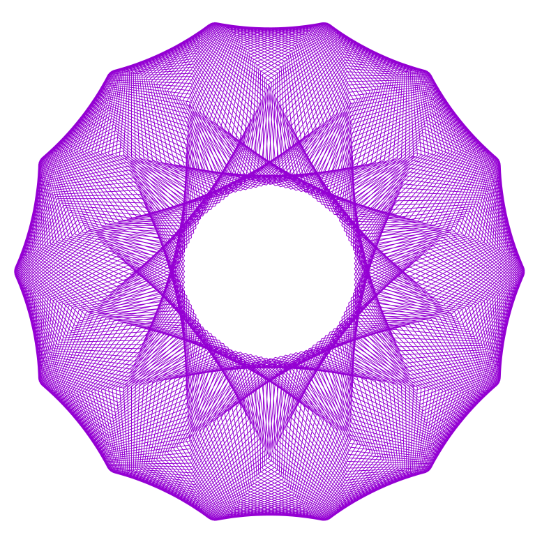
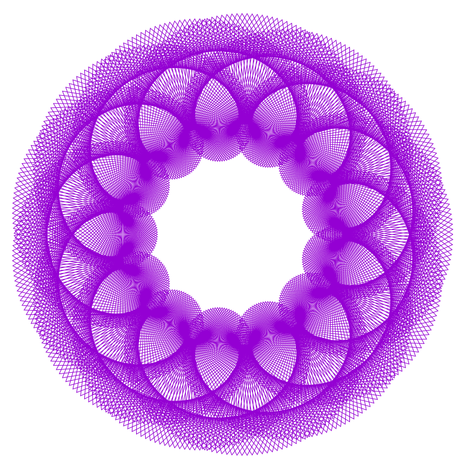
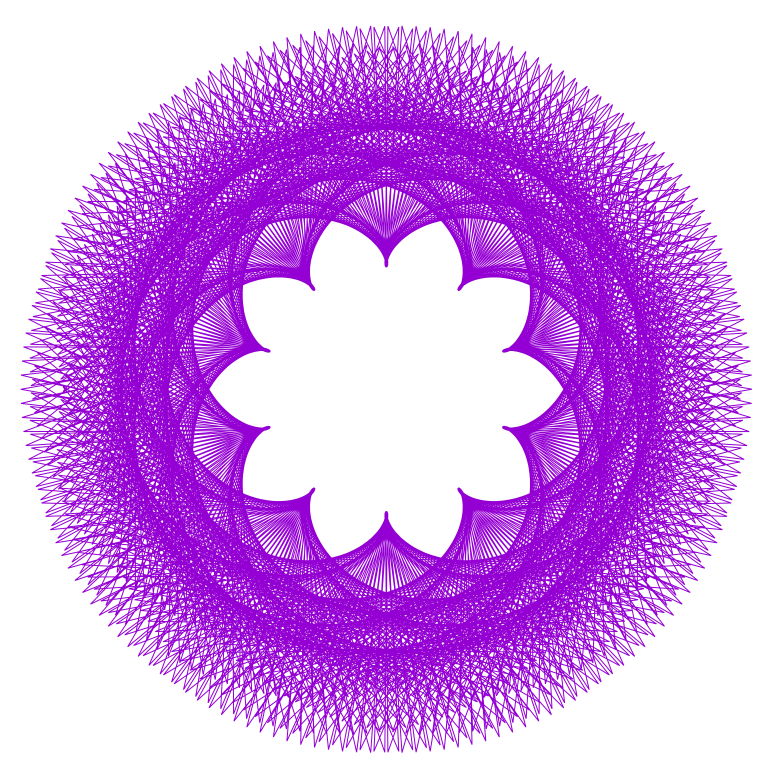
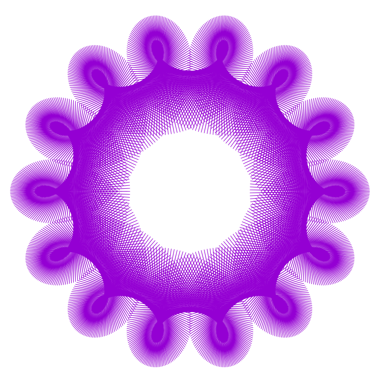
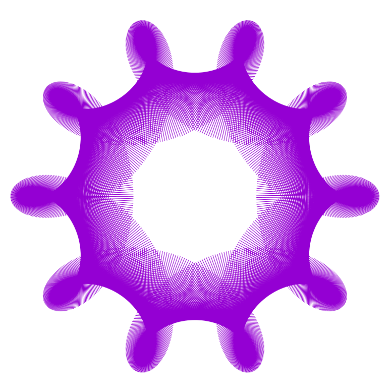
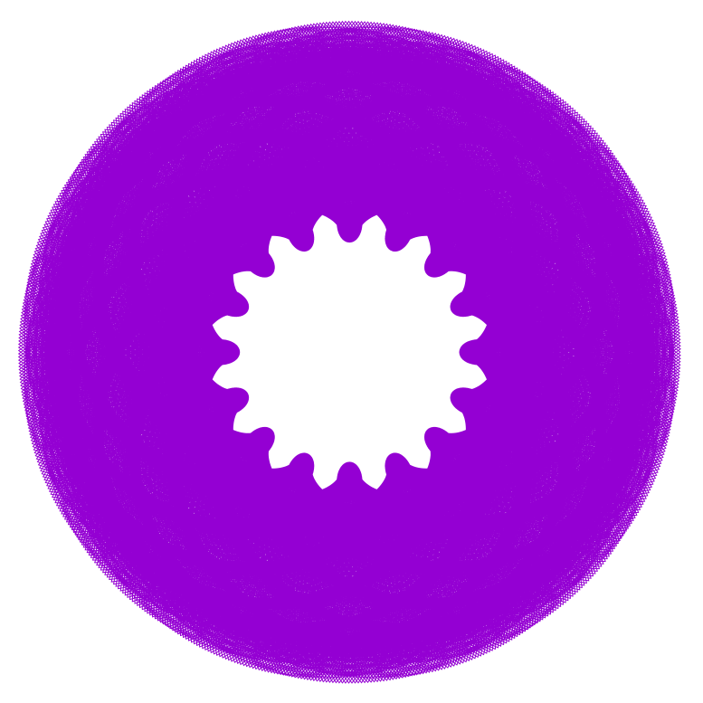
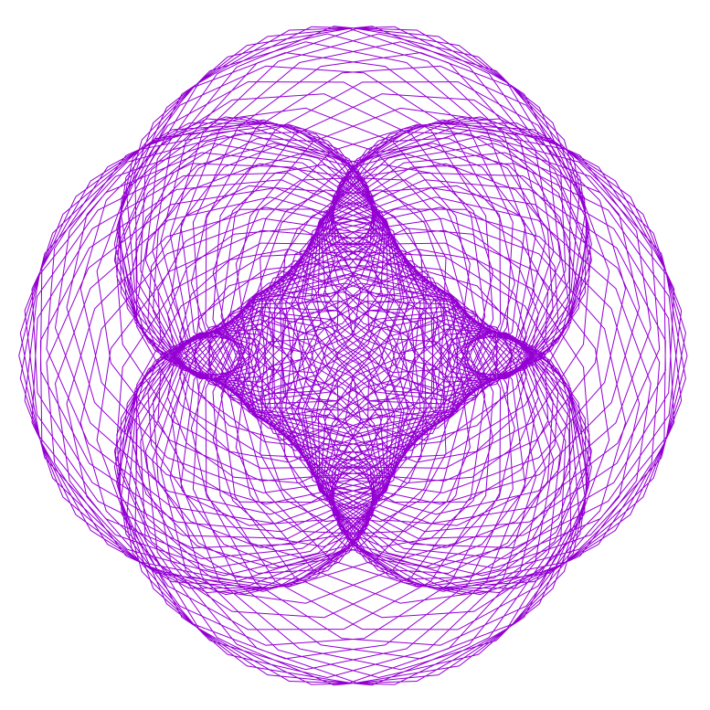
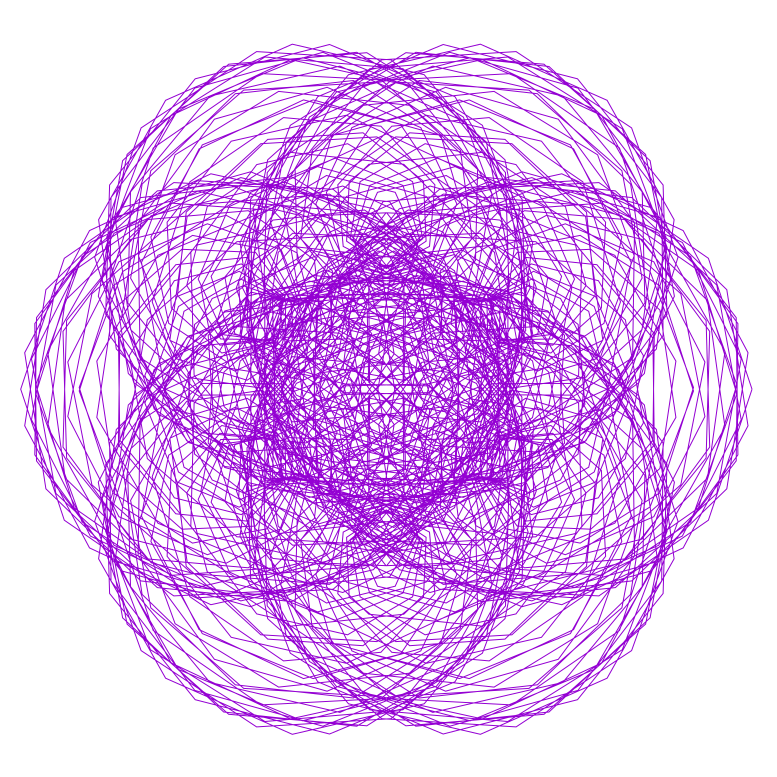
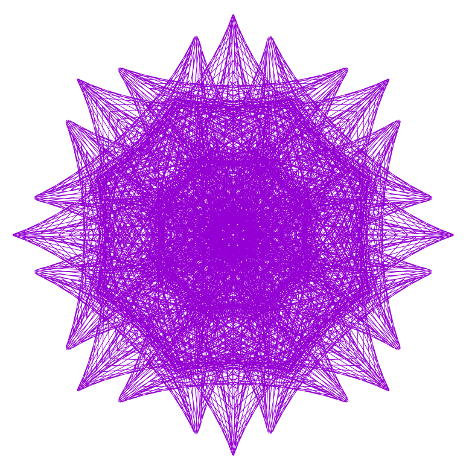

# Geometry calculator

Produces beautiful geometry

Only 5353 bytes in size!

```
maczito:fx-flower k$ du -ks . 
32	.

maczito:fx-flower k$ wc -c * 
     310 base.md
    1357 cx.sh
       0 im.log
     128 launch.sh
     488 preparecommands.sh
     522 runner.sh
    2276 samples.sh
     272 updatereadme.sh
    5353 total

maczito:fx-flower k$ ls -lha
total 64
drwxr-xr-x  11 k     wheel   352B 24 lip 23:43 .
drwxrwxrwt  14 root  wheel   448B 24 lip 23:42 ..
-rw-r--r--   1 k     wheel    44B 24 lip 23:43 .gitignore
-rw-r--r--   1 k     wheel   310B 24 lip 23:43 base.md
-rwxr-xr-x   1 k     wheel   1,3K 24 lip 23:43 cx.sh
-rw-r--r--   1 k     wheel     0B 24 lip 23:43 im.log
-rwxr-xr-x   1 k     wheel   128B 24 lip 23:43 launch.sh
-rwxr-xr-x   1 k     wheel   488B 24 lip 23:43 preparecommands.sh
-rwxr-xr-x   1 k     wheel   522B 24 lip 23:43 runner.sh
-rwxr-xr-x   1 k     wheel   2,2K 24 lip 23:43 samples.sh
-rwxr-xr-x   1 k     wheel   272B 24 lip 23:43 updatereadme.sh
```

## Requiremens:
```
brew install parallel gnuplot
```
## Usage

Generates entire set of 999^3 images

If you want to generate less, tweak parallel command to include less input.

```
./preparecommands.sh `pwd` out/images
./launch.sh
```

## For some nice samples press:

```
./samples.sh
open samples
```

## To generate just 1 image

x=480
y=648
z=816
plotsize=2001

```
mkdir tmp
./cx.sh 480 648 816 tmp/ 2001
open tmp
```

### Links

https://linuxgazette.net/133/luana.html

## Samples

Values X: 0001 Y: 0001 Z: 0284, P: 2001 

Values X: 0001 Y: 0001 Z: 0331, P: 2001 

Values X: 0001 Y: 0001 Z: 0332, P: 2001 

Values X: 0001 Y: 0001 Z: 0333, P: 2001 

Values X: 0001 Y: 0001 Z: 0363, P: 2001 

Values X: 0001 Y: 0001 Z: 0398, P: 2001 

Values X: 0001 Y: 0001 Z: 0399, P: 2001 

Values X: 0001 Y: 0001 Z: 0400, P: 2001 

Values X: 0001 Y: 0001 Z: 0443, P: 2001 

Values X: 0001 Y: 0001 Z: 0444, P: 2001 

Values X: 0001 Y: 0001 Z: 0445, P: 2001 

Values X: 0001 Y: 0001 Z: 0446, P: 2001 

Values X: 0001 Y: 0001 Z: 0447, P: 2001 

Values X: 0001 Y: 0001 Z: 0463, P: 2001 

Values X: 0001 Y: 0001 Z: 0464, P: 2001 

Values X: 0001 Y: 0001 Z: 0495, P: 2001 

Values X: 0001 Y: 0001 Z: 0496, P: 2001 

Values X: 0001 Y: 0001 Z: 0498, P: 2001 

Values X: 0001 Y: 0001 Z: 0499, P: 2001 

Values X: 0001 Y: 0001 Z: 0500, P: 2001 

Values X: 0001 Y: 0001 Z: 0501, P: 2001 

Values X: 0001 Y: 0001 Z: 0502, P: 2001 

Values X: 0001 Y: 0001 Z: 0503, P: 2001 

Values X: 0001 Y: 0001 Z: 0545, P: 2001 

Values X: 0001 Y: 0001 Z: 0547, P: 2001 

Values X: 0001 Y: 0001 Z: 0548, P: 2001 

Values X: 0001 Y: 0001 Z: 0570, P: 2001 

Values X: 0001 Y: 0001 Z: 0571, P: 2001 

Values X: 0001 Y: 0001 Z: 0572, P: 2001 

Values X: 0001 Y: 0001 Z: 0573, P: 2001 

Values X: 0001 Y: 0001 Z: 0574, P: 2001 

Values X: 0001 Y: 0001 Z: 0602, P: 2001 

Values X: 0001 Y: 0001 Z: 0661, P: 2001 

Values X: 0001 Y: 0001 Z: 0662, P: 2001 

Values X: 0001 Y: 0001 Z: 0663, P: 2001 

Values X: 0001 Y: 0001 Z: 0664, P: 2001 

Values X: 0001 Y: 0001 Z: 0665, P: 2001 

Values X: 0001 Y: 0001 Z: 0666, P: 2001 

Values X: 0001 Y: 0001 Z: 0667, P: 2001 

Values X: 0001 Y: 0001 Z: 0668, P: 2001 

Values X: 0001 Y: 0001 Z: 0669, P: 2001 

Values X: 0001 Y: 0001 Z: 0670, P: 2001 

Values X: 0001 Y: 0001 Z: 0671, P: 2001 

Values X: 0001 Y: 0001 Z: 0672, P: 2001 

Values X: 0001 Y: 0001 Z: 0716, P: 2001 

Values X: 0001 Y: 0001 Z: 0727, P: 2001 

Values X: 0001 Y: 0001 Z: 0728, P: 2001 

Values X: 0001 Y: 0001 Z: 0729, P: 2001 

Values X: 0001 Y: 0001 Z: 0730, P: 2001 

Values X: 0001 Y: 0001 Z: 0752, P: 2001 

Values X: 0001 Y: 0001 Z: 0798, P: 2001 

Values X: 0001 Y: 0001 Z: 0799, P: 2001 

Values X: 0001 Y: 0001 Z: 0800, P: 2001 

Values X: 0001 Y: 0001 Z: 0801, P: 2001 

Values X: 0001 Y: 0001 Z: 0802, P: 2001 

Values X: 0001 Y: 0001 Z: 0835, P: 2001 

Values X: 0001 Y: 0001 Z: 0855, P: 2001 

Values X: 0001 Y: 0001 Z: 0856, P: 2001 

Values X: 0001 Y: 0001 Z: 0857, P: 2001 

Values X: 0001 Y: 0001 Z: 0859, P: 2001 

Values X: 0001 Y: 0001 Z: 0860, P: 2001 

Values X: 0001 Y: 0001 Z: 0886, P: 2001 

Values X: 0001 Y: 0001 Z: 0887, P: 2001 

Values X: 0001 Y: 0001 Z: 0889, P: 2001 

Values X: 0001 Y: 0001 Z: 0891, P: 2001 

Values X: 0001 Y: 0001 Z: 0911, P: 2001 

Values X: 0001 Y: 0001 Z: 0912, P: 2001 

Values X: 0001 Y: 0001 Z: 0925, P: 2001 

Values X: 0001 Y: 0001 Z: 0935, P: 2001 

Values X: 0001 Y: 0001 Z: 0939, P: 2001 

Values X: 0001 Y: 0001 Z: 0943, P: 2001 

Values X: 0001 Y: 0001 Z: 0994, P: 2001 

Values X: 0001 Y: 0001 Z: 0995, P: 2001 

Values X: 0001 Y: 0001 Z: 0996, P: 2001 

Values X: 0001 Y: 0001 Z: 0997, P: 2001 

Values X: 0001 Y: 0001 Z: 0998, P: 2001 

Values X: 0001 Y: 0001 Z: 0999, P: 2001 

Values X: 0001 Y: 0001 Z: 1000, P: 2001 

Values X: 0001 Y: 0001 Z: 1001, P: 2001 

Values X: 0001 Y: 0001 Z: 1002, P: 2001 

Values X: 0001 Y: 0001 Z: 1003, P: 2001 

Values X: 0001 Y: 0001 Z: 1004, P: 2001 

Values X: 0001 Y: 0001 Z: 1005, P: 2001 

Values X: 0001 Y: 0001 Z: 1006, P: 2001 

Values X: 0001 Y: 0001 Z: 1007, P: 2001 

Values X: 0001 Y: 0001 Z: 1008, P: 2001 

Values X: 0001 Y: 0001 Z: 1197, P: 2001 

Values X: 0001 Y: 0001 Z: 1198, P: 2001 

Values X: 0001 Y: 0001 Z: 1199, P: 2001 

Values X: 0001 Y: 0001 Z: 1200, P: 2001 

Values X: 0001 Y: 0001 Z: 1201, P: 2001 

Values X: 0001 Y: 0001 Z: 1202, P: 2001 

Values X: 0001 Y: 0001 Z: 1203, P: 2001 

Values X: 0001 Y: 0001 Z: 1252, P: 2001 

Values X: 0001 Y: 0001 Z: 1329, P: 2001 

Values X: 0001 Y: 0001 Z: 1330, P: 2001 

Values X: 0001 Y: 0001 Z: 1331, P: 2001 

Values X: 0001 Y: 0001 Z: 1332, P: 2001 

Values X: 0001 Y: 0001 Z: 1333, P: 2001 

Values X: 0001 Y: 0001 Z: 1334, P: 2001 

Values X: 0001 Y: 0001 Z: 1335, P: 2001 

Values X: 0001 Y: 0001 Z: 1336, P: 2001 

Values X: 0001 Y: 0001 Z: 1497, P: 2001 

Values X: 0001 Y: 0001 Z: 1498, P: 2001 

Values X: 0001 Y: 0001 Z: 1499, P: 2001 

Values X: 0001 Y: 0001 Z: 1500, P: 2001 

Values X: 0001 Y: 0001 Z: 1501, P: 2001 

Values X: 0001 Y: 0001 Z: 1502, P: 2001 

Values X: 0001 Y: 0001 Z: 1503, P: 2001 

Values X: 0001 Y: 0001 Z: 1991, P: 2001 

Values X: 0001 Y: 0001 Z: 1992, P: 2001 

Values X: 0001 Y: 0001 Z: 1993, P: 2001 

Values X: 0001 Y: 0001 Z: 1994, P: 2001 

Values X: 0001 Y: 0001 Z: 1995, P: 2001 

Values X: 0001 Y: 0001 Z: 1996, P: 2001 

Values X: 0001 Y: 0001 Z: 1997, P: 2001 

Values X: 0001 Y: 0001 Z: 1998, P: 2001 

Values X: 0001 Y: 0001 Z: 1999, P: 2001 

Values X: 0001 Y: 0001 Z: 1999, P: 9999 

Values X: 0001 Y: 0001 Z: 2000, P: 9999 

Values X: 0001 Y: 0001 Z: 2001, P: 9999 

Values X: 0001 Y: 0001 Z: 2103, P: 9999 

Values X: 0001 Y: 0001 Z: 2498, P: 9999 

Values X: 0001 Y: 0001 Z: 2499, P: 9999 

Values X: 0001 Y: 0001 Z: 2500, P: 9999 

Values X: 0001 Y: 0001 Z: 2501, P: 9999 

Values X: 0001 Y: 0001 Z: 2502, P: 9999 

Values X: 0001 Y: 0001 Z: 2854, P: 9999 

Values X: 0001 Y: 0001 Z: 2856, P: 9999 

Values X: 0001 Y: 0001 Z: 2858, P: 9999 

Values X: 0001 Y: 0001 Z: 3001, P: 9999 

Values X: 0001 Y: 0001 Z: 3002, P: 9999 

Values X: 0001 Y: 0001 Z: 3329, P: 9999 

Values X: 0001 Y: 0001 Z: 3331, P: 9999 

Values X: 0001 Y: 0001 Z: 3332, P: 9999 

Values X: 0001 Y: 0001 Z: 3333, P: 9999 

Values X: 0001 Y: 0001 Z: 3334, P: 9999 

Values X: 0001 Y: 0001 Z: 3335, P: 9999 

Values X: 0001 Y: 0001 Z: 3336, P: 9999 

Values X: 0001 Y: 0001 Z: 3337, P: 9999 

Values X: 0001 Y: 0001 Z: 3637, P: 9999 

Values X: 0001 Y: 0001 Z: 3638, P: 9999 

Values X: 0001 Y: 0001 Z: 3746, P: 9999 

Values X: 0001 Y: 0001 Z: 3747, P: 9999 

Values X: 0001 Y: 0001 Z: 3748, P: 9999 

Values X: 0001 Y: 0001 Z: 3751, P: 9999 

Values X: 0001 Y: 0001 Z: 3752, P: 9999 

Values X: 0001 Y: 0001 Z: 3847, P: 9999 

Values X: 0001 Y: 0001 Z: 3994, P: 9999 

Values X: 0001 Y: 0001 Z: 3996, P: 9999 

Values X: 0001 Y: 0001 Z: 3997, P: 9999 

Values X: 0001 Y: 0001 Z: 3998, P: 9999 

Values X: 0001 Y: 0001 Z: 4001, P: 9999 

Values X: 0001 Y: 0001 Z: 4002, P: 9999 

Values X: 0001 Y: 0001 Z: 4282, P: 9999 

Values X: 0001 Y: 0001 Z: 4284, P: 9999 

Values X: 0001 Y: 0001 Z: 4287, P: 9999 

Values X: 0001 Y: 0001 Z: 4288, P: 9999 

Values X: 0001 Y: 0001 Z: 4372, P: 9999 

Values X: 0001 Y: 0001 Z: 4441, P: 9999 

Values X: 0001 Y: 0001 Z: 4442, P: 9999 

Values X: 0001 Y: 0001 Z: 4445, P: 9999 

Values X: 0001 Y: 0001 Z: 4446, P: 9999 

Values X: 0001 Y: 0001 Z: 4542, P: 9999 

Values X: 0001 Y: 0001 Z: 4546, P: 9999 

Values X: 0001 Y: 0001 Z: 4616, P: 9999 

Values X: 0001 Y: 0001 Z: 4990, P: 9999 

Values X: 0001 Y: 0001 Z: 4991, P: 9999 

Values X: 0001 Y: 0001 Z: 4992, P: 9999 

Values X: 0001 Y: 0001 Z: 4993, P: 9999 

Values X: 0001 Y: 0001 Z: 4994, P: 9999 

Values X: 0001 Y: 0001 Z: 4995, P: 9999 

Values X: 0001 Y: 0001 Z: 4996, P: 9999 

Values X: 0001 Y: 0001 Z: 4997, P: 9999 

Values X: 0001 Y: 0001 Z: 4998, P: 9999 

Values X: 0001 Y: 0001 Z: 4999, P: 9999 

Values X: 0001 Y: 0001 Z: 5000, P: 9999 

Values X: 0001 Y: 0001 Z: 5001, P: 9999 

Values X: 0001 Y: 0001 Z: 5002, P: 9999 

Values X: 0001 Y: 0001 Z: 5003, P: 9999 

Values X: 0001 Y: 0001 Z: 5004, P: 9999 

Values X: 0001 Y: 0001 Z: 5005, P: 9999 

Values X: 0001 Y: 0001 Z: 5006, P: 9999 

Values X: 0001 Y: 0001 Z: 5214, P: 9999 

Values X: 0001 Y: 0001 Z: 5239, P: 9999 

Values X: 0001 Y: 0001 Z: 5260, P: 9999 

Values X: 0001 Y: 0001 Z: 5291, P: 9999 

Values X: 0001 Y: 0001 Z: 5295, P: 9999 

Values X: 0001 Y: 0001 Z: 5334, P: 9999 

Values X: 0001 Y: 0001 Z: 5335, P: 9999 

Values X: 0001 Y: 0001 Z: 5381, P: 9999 

Values X: 0001 Y: 0001 Z: 5382, P: 9999 

Values X: 0001 Y: 0001 Z: 5385, P: 9999 

Values X: 0001 Y: 0001 Z: 5386, P: 9999 

Values X: 0001 Y: 0121 Z: 0011, P: 2001 

Values X: 0001 Y: 0121 Z: 0016, P: 2001 

Values X: 0001 Y: 0121 Z: 0039, P: 2001 

Values X: 0001 Y: 0121 Z: 0040, P: 2001 

Values X: 0001 Y: 0121 Z: 0059, P: 2001 

Values X: 0001 Y: 0121 Z: 0060, P: 2001 

Values X: 0001 Y: 0121 Z: 0074, P: 2001 

Values X: 0001 Y: 0121 Z: 0082, P: 2001 

Values X: 0001 Y: 0121 Z: 0084, P: 2001 

Values X: 0001 Y: 0121 Z: 0092, P: 2001 

Values X: 0001 Y: 0121 Z: 0093, P: 2001 

Values X: 0001 Y: 0121 Z: 0094, P: 2001 

Values X: 0001 Y: 0121 Z: 0098, P: 2001 

Values X: 0001 Y: 0121 Z: 0109, P: 2001 

Values X: 0001 Y: 0121 Z: 0115, P: 2001 

Values X: 0001 Y: 0121 Z: 0116, P: 2001 

Values X: 0001 Y: 0121 Z: 0118, P: 2001 

Values X: 0001 Y: 0121 Z: 0125, P: 2001 

Values X: 0001 Y: 0121 Z: 0129, P: 2001 

Values X: 0001 Y: 0121 Z: 0130, P: 2001 

Values X: 0001 Y: 0121 Z: 0131, P: 2001 

Values X: 0001 Y: 0121 Z: 0136, P: 2001 

Values X: 0001 Y: 0121 Z: 0140, P: 2001 

Values X: 0001 Y: 0121 Z: 0144, P: 2001 

Values X: 0001 Y: 0121 Z: 0160, P: 2001 

Values X: 0001 Y: 0121 Z: 0163, P: 2001 

Values X: 0001 Y: 0121 Z: 0171, P: 2001 

Values X: 0001 Y: 0121 Z: 0183, P: 2001 

Values X: 0001 Y: 0121 Z: 0203, P: 2001 

Values X: 0001 Y: 0121 Z: 0216, P: 2001 

Values X: 0001 Y: 0121 Z: 0220, P: 2001 

Values X: 0001 Y: 0121 Z: 0235, P: 2001 

Values X: 0001 Y: 0121 Z: 0236, P: 2001 

Values X: 0001 Y: 0121 Z: 0237, P: 2001 

Values X: 0001 Y: 0121 Z: 0238, P: 2001 

Values X: 0001 Y: 0121 Z: 0239, P: 2001 

Values X: 0001 Y: 0121 Z: 0244, P: 2001 

Values X: 0001 Y: 0121 Z: 0245, P: 2001 

Values X: 0001 Y: 0121 Z: 0246, P: 2001 

Values X: 0001 Y: 0121 Z: 0247, P: 2001 

Values X: 0001 Y: 0121 Z: 0280, P: 2001 

Values X: 0001 Y: 0121 Z: 0304, P: 2001 

Values X: 0001 Y: 0121 Z: 0305, P: 2001 

Values X: 0001 Y: 0121 Z: 0321, P: 2001 

Values X: 0001 Y: 0121 Z: 0336, P: 2001 

Values X: 0001 Y: 0121 Z: 0359, P: 2001 

Values X: 0001 Y: 0121 Z: 0363, P: 2001 

Values X: 0001 Y: 0121 Z: 0365, P: 2001 

Values X: 0001 Y: 0121 Z: 0366, P: 2001 

Values X: 0001 Y: 0121 Z: 0367, P: 2001 

Values X: 0001 Y: 0121 Z: 0368, P: 2001 

Values X: 0001 Y: 0121 Z: 0441, P: 2001 

Values X: 0001 Y: 0121 Z: 0478, P: 2001 

Values X: 0001 Y: 0121 Z: 0481, P: 2001 

Values X: 0001 Y: 0121 Z: 0485, P: 2001 

Values X: 0001 Y: 0121 Z: 0486, P: 2001 

Values X: 0001 Y: 0121 Z: 0487, P: 2001 

Values X: 0001 Y: 0121 Z: 0488, P: 2001 

Values X: 0001 Y: 0121 Z: 0489, P: 2001 

Values X: 0001 Y: 0121 Z: 0499, P: 2001 

Values X: 0001 Y: 0121 Z: 0505, P: 2001 

Values X: 0001 Y: 0121 Z: 0521, P: 2001 

Values X: 0001 Y: 0121 Z: 0545, P: 2001 

Values X: 0001 Y: 0121 Z: 0585, P: 2001 

Values X: 0001 Y: 0121 Z: 0586, P: 2001 

Values X: 0001 Y: 0121 Z: 0605, P: 2001 

Values X: 0001 Y: 0121 Z: 0606, P: 2001 

Values X: 0001 Y: 0121 Z: 0607, P: 2001 

Values X: 0001 Y: 0121 Z: 0626, P: 2001 

Values X: 0001 Y: 0121 Z: 0654, P: 2001 

Values X: 0001 Y: 0121 Z: 0666, P: 2001 

Values X: 0001 Y: 0121 Z: 0667, P: 2001 

Values X: 0001 Y: 0121 Z: 0680, P: 2001 

Values X: 0001 Y: 0121 Z: 0683, P: 2001 

Values X: 0001 Y: 0121 Z: 0695, P: 2001 

Values X: 0001 Y: 0121 Z: 0698, P: 2001 

Values X: 0001 Y: 0121 Z: 0701, P: 2001 

Values X: 0001 Y: 0121 Z: 0706, P: 2001 

Values X: 0001 Y: 0121 Z: 0727, P: 2001 

Values X: 0001 Y: 0121 Z: 0746, P: 2001 

Values X: 0001 Y: 0121 Z: 0751, P: 2001 

Values X: 0001 Y: 0121 Z: 0756, P: 2001 

Values X: 0001 Y: 0121 Z: 0757, P: 2001 

Values X: 0001 Y: 0121 Z: 0761, P: 2001 

Values X: 0001 Y: 0121 Z: 0776, P: 2001 

Values X: 0001 Y: 0121 Z: 0787, P: 2001 

Values X: 0001 Y: 0121 Z: 0788, P: 2001 

Values X: 0001 Y: 0121 Z: 0791, P: 2001 

Values X: 0001 Y: 0121 Z: 0800, P: 2001 

Values X: 0001 Y: 0121 Z: 0816, P: 2001 

Values X: 0001 Y: 0121 Z: 0817, P: 2001 

Values X: 0001 Y: 0121 Z: 0829, P: 2001 

Values X: 0001 Y: 0121 Z: 0848, P: 2001 

Values X: 0001 Y: 0121 Z: 0849, P: 2001 

Values X: 0001 Y: 0121 Z: 0877, P: 2001 

Values X: 0001 Y: 0121 Z: 0878, P: 2001 

Values X: 0001 Y: 0121 Z: 0898, P: 2001 

Values X: 0001 Y: 0121 Z: 0908, P: 2001 

Values X: 0001 Y: 0121 Z: 0909, P: 2001 

Values X: 0001 Y: 0121 Z: 0919, P: 2001 

Values X: 0001 Y: 0121 Z: 0938, P: 2001 

Values X: 0001 Y: 0121 Z: 0939, P: 2001 

Values X: 0001 Y: 0121 Z: 0959, P: 2001 

Values X: 0001 Y: 0121 Z: 0961, P: 2001 

Values X: 0001 Y: 0121 Z: 0968, P: 2001 

Values X: 0001 Y: 0121 Z: 0969, P: 2001 

Values X: 0001 Y: 0121 Z: 0970, P: 2001 

Values X: 0001 Y: 0121 Z: 0979, P: 2001 

Values X: 0001 Y: 0121 Z: 0993, P: 2001 

Values X: 0001 Y: 0121 Z: 0995, P: 2001 

Values X: 0001 Y: 0121 Z: 0996, P: 2001 

Values X: 0001 Y: 0121 Z: 0997, P: 2001 

Values X: 0001 Y: 0121 Z: 0999, P: 2001 

