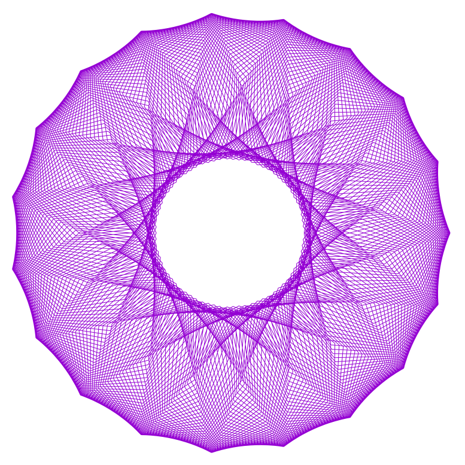
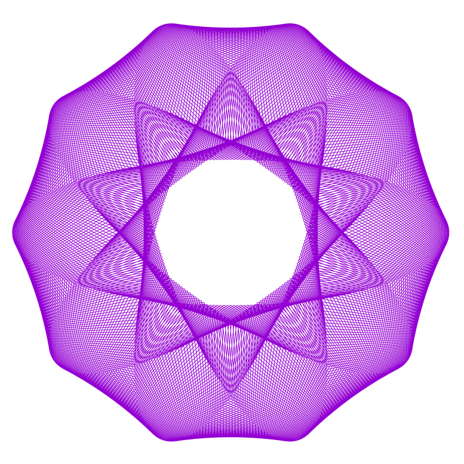
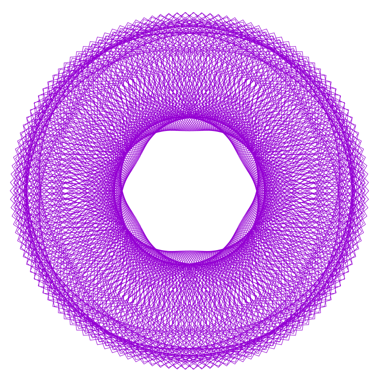
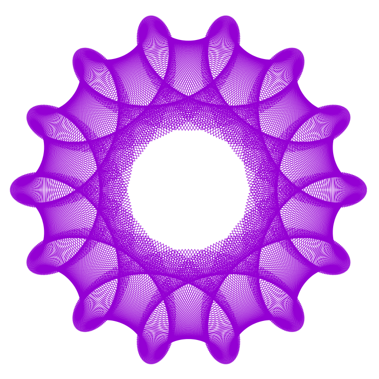
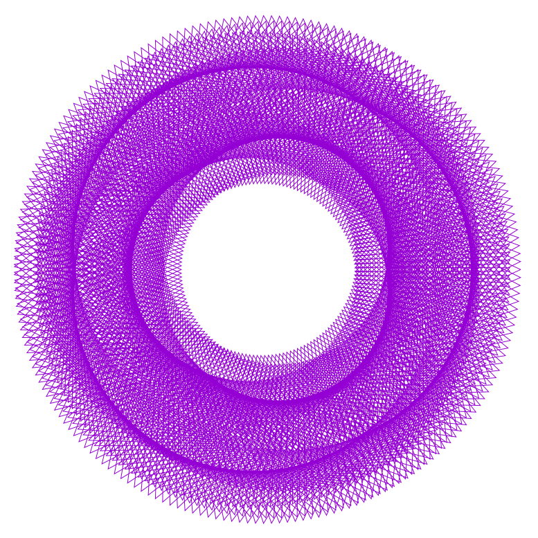
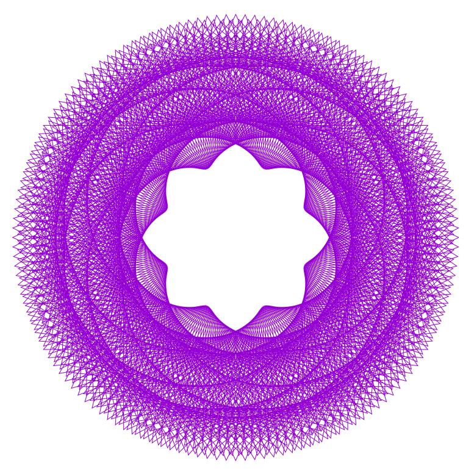
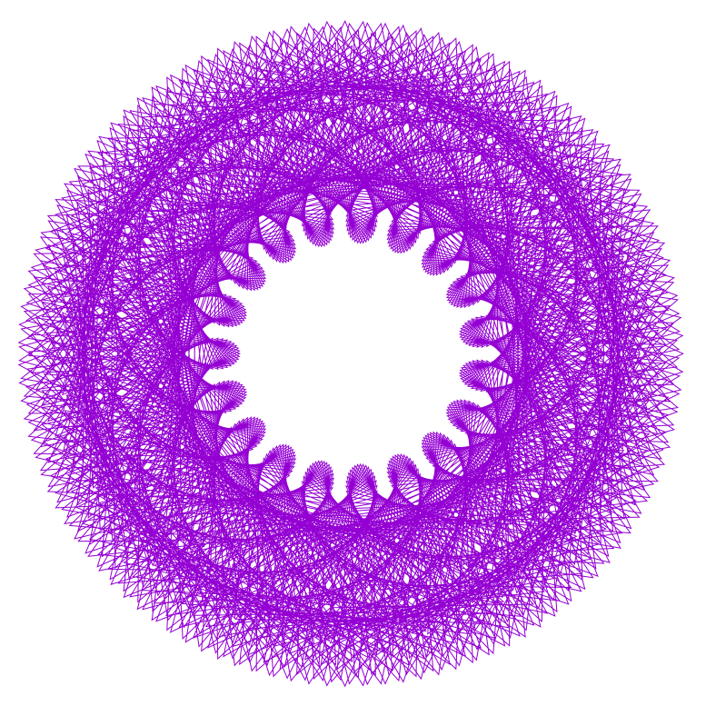
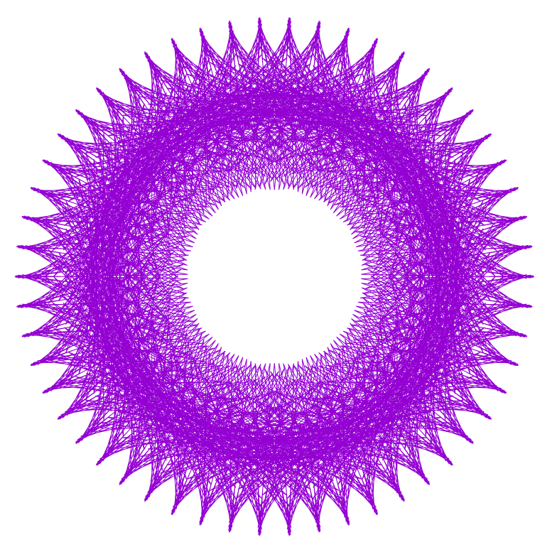

# Geometry calculator

Produces beautiful geometry

Only 5353 bytes in size!

```
maczito:fx-flower k$ du -ks . 
32	.

maczito:fx-flower k$ wc -c * 
     310 base.md
    1357 cx.sh
       0 im.log
     128 launch.sh
     488 preparecommands.sh
     522 runner.sh
    2276 samples.sh
     272 updatereadme.sh
    5353 total

maczito:fx-flower k$ ls -lha
total 64
drwxr-xr-x  11 k     wheel   352B 24 lip 23:43 .
drwxrwxrwt  14 root  wheel   448B 24 lip 23:42 ..
-rw-r--r--   1 k     wheel    44B 24 lip 23:43 .gitignore
-rw-r--r--   1 k     wheel   310B 24 lip 23:43 base.md
-rwxr-xr-x   1 k     wheel   1,3K 24 lip 23:43 cx.sh
-rw-r--r--   1 k     wheel     0B 24 lip 23:43 im.log
-rwxr-xr-x   1 k     wheel   128B 24 lip 23:43 launch.sh
-rwxr-xr-x   1 k     wheel   488B 24 lip 23:43 preparecommands.sh
-rwxr-xr-x   1 k     wheel   522B 24 lip 23:43 runner.sh
-rwxr-xr-x   1 k     wheel   2,2K 24 lip 23:43 samples.sh
-rwxr-xr-x   1 k     wheel   272B 24 lip 23:43 updatereadme.sh
```

## Requiremens:
```
brew install parallel gnuplot
```
## Usage

Generates entire set of 999^3 images

If you want to generate less, tweak parallel command to include less input.

```
./preparecommands.sh `pwd` out/images
./launch.sh
```

## For some nice samples press:

```
./samples.sh
open samples
```

## To generate just 1 image

x=480
y=648
z=816
plotsize=2001

```
mkdir tmp
./cx.sh 480 648 816 tmp/ 2001
open tmp
```

### Links

https://linuxgazette.net/133/luana.html

## Samples

Values: Values: 0001 0001 0284



Values: Values: 0001 0001 0331


Values: Values: 0001 0001 0332


Values: Values: 0001 0001 0333


Values: Values: 0001 0001 0363


Values: Values: 0001 0001 0398


Values: Values: 0001 0001 0399



Values: Values: 0001 0001 0400


Values: Values: 0001 0001 0443


Values: Values: 0001 0001 0444


Values: Values: 0001 0001 0445


Values: Values: 0001 0001 0446


Values: Values: 0001 0001 0447


Values: Values: 0001 0001 0463



Values: Values: 0001 0001 0464


Values: Values: 0001 0001 0495


Values: Values: 0001 0001 0496


Values: Values: 0001 0001 0498


Values: Values: 0001 0001 0499


Values: Values: 0001 0001 0500


Values: Values: 0001 0001 0501


Values: Values: 0001 0001 0502


Values: Values: 0001 0001 0503


Values: Values: 0001 0001 0545


Values: Values: 0001 0001 0547


Values: Values: 0001 0001 0548


Values: Values: 0001 0001 0570


Values: Values: 0001 0001 0571


Values: Values: 0001 0001 0572


Values: Values: 0001 0001 0573


Values: Values: 0001 0001 0574


Values: Values: 0001 0001 0602


Values: Values: 0001 0001 0661


Values: Values: 0001 0001 0662


Values: Values: 0001 0001 0663



Values: Values: 0001 0001 0664


Values: Values: 0001 0001 0665


Values: Values: 0001 0001 0666


Values: Values: 0001 0001 0667


Values: Values: 0001 0001 0668


Values: Values: 0001 0001 0669


Values: Values: 0001 0001 0670


Values: Values: 0001 0001 0671


Values: Values: 0001 0001 0672


Values: Values: 0001 0001 0716


Values: Values: 0001 0001 0727


Values: Values: 0001 0001 0728



Values: Values: 0001 0001 0729



Values: Values: 0001 0001 0730



Values: Values: 0001 0001 0752


Values: Values: 0001 0001 0798


Values: Values: 0001 0001 0799


Values: Values: 0001 0001 0800


Values: Values: 0001 0001 0801


Values: Values: 0001 0001 0802


Values: Values: 0001 0001 0835


Values: Values: 0001 0001 0855


Values: Values: 0001 0001 0856


Values: Values: 0001 0001 0857


Values: Values: 0001 0001 0859


Values: Values: 0001 0001 0860


Values: Values: 0001 0001 0886


Values: Values: 0001 0001 0887


Values: Values: 0001 0001 0889


Values: Values: 0001 0001 0891


Values: Values: 0001 0001 0911


Values: Values: 0001 0001 0912


Values: Values: 0001 0001 0925


Values: Values: 0001 0001 0935


Values: Values: 0001 0001 0939



Values: Values: 0001 0001 0943


Values: Values: 0001 0001 0994


Values: Values: 0001 0001 0995


Values: Values: 0001 0001 0996


Values: Values: 0001 0001 0997


Values: Values: 0001 0001 0998


Values: Values: 0001 0001 0999


